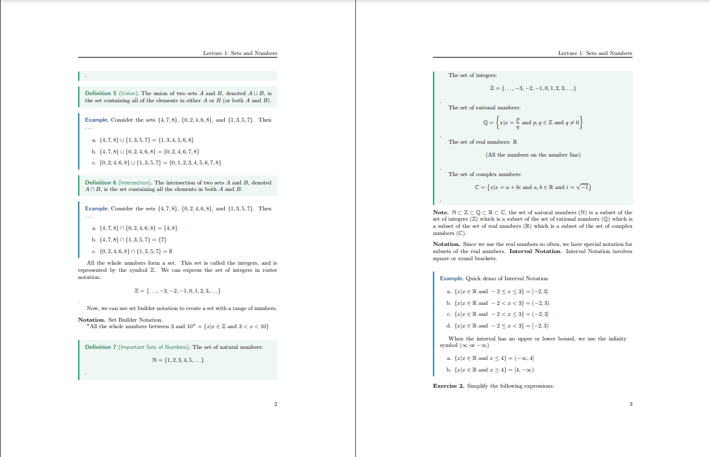
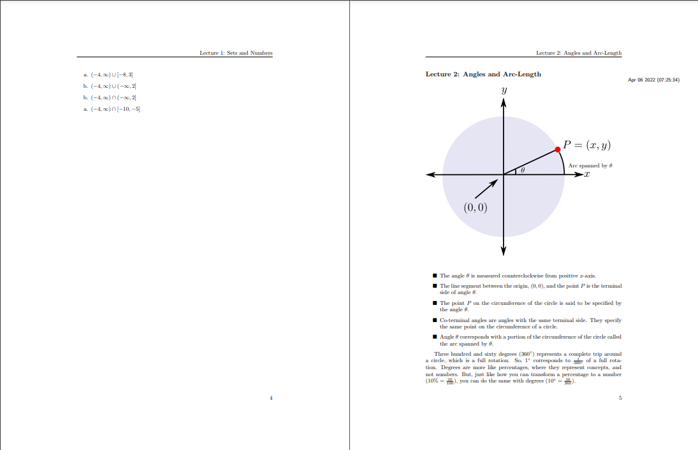
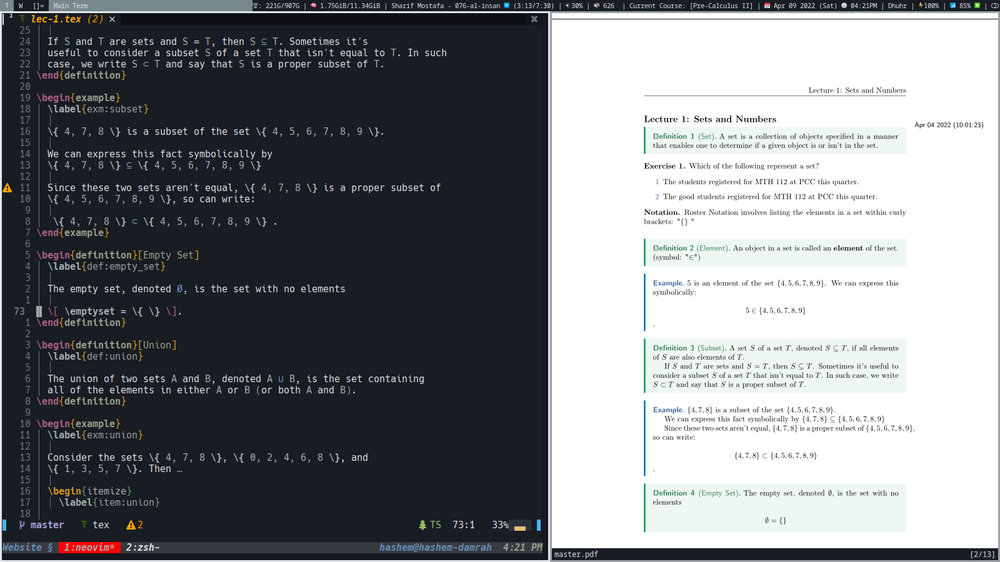

For a **very long time**, I have been trying to create the perfect setup for
note taking in general (but more specifically, for **math**). Before, I used to
use <a class="center after" href="https://www.notion.com">notion</a> to take my
notes, which was okay, but I wanted something much more productive. And thus,
my system was **BORN**!

Here are how some of my notes look like:




You can look at my notes source code
<a class="center after" href="https://damrah.netlify.app/notes/">here</a>.
I also store all of my final notes
<a class="center after" href="https://www.github.com/SingularisArt/notes">here</a>.

I created this method during the summer of my **10th year** in high school. I am
preparing my self for when I go to university. So I set myself **4** goals and
these goals must be met for me to use the system.

They are:

- Writing mathematical equations as fast (or faster) than my professor was an
  **A MUST**.
- Drawing the figures must be as **easy**, **fast**, and **simple**.
- It must feel like I am writing them on paper.
- My notes are very easily
  **manageable** and easy to **access**.

I will eventually have a ton of posts talking about this specific subject, but
for now, I will go over **Step 1**.

## NeoVim and LaTeX

**NeoVim** is a terminal-based text editor. It's just a better version of Vim,
which was made back in the 91.

I literally use NeoVim for everything. (You can find my custom NeoVim config
<a class="center after" href="https://www.github.com/SingularisArt/Death.NeoVim">here</a>).

**LaTeX** is a markup language used by mostly professors who want to publish
their papers, which is unfortunate because it's a great tool to take notes on,
not just for school. This setup took me about 1 year to make and it's still a
work in the progress. Luckily, for you, you won't have to figure anything out
because I've done all of that for you.

Now, with that out of the way, here is what my screen looks like when I am
working with LaTeX:



On the left side, I have my editor (**NeoVim**) and on the right side, I have
my pdf viewer **Zathura**.

Here is a quick list of all of my utilities:

- OS (Operating System):
  <a class="center after" href="https://www.archlinux.org/">**Arch Linux**</a>
- WM (Window Manager):
  <a class="center after" href="https://www.dwm.suckless.org/">**DWM**</a>
- Text Editor:
  <a class="center after" href="https://www.github.com/neovim/neovim">**NeoVim**</a>
- Pdf Viewer:
  <a class="center after" href="https://www.github.com/pwmt/zathura">**Zathura**</a>
- Terminal Emulator:
  <a class="center after" href="https://docs.xfce.org/apps/terminal/start">**Xfce4-Terminal**</a>

I have a huge list of plugins that you can view
<a class="center after" href="https://github.com/SingularisArt/Death.NeoVim/tree/master/pack/bundle/opt">here</a>),
but the plugin that I use for **LaTeX** is
<a class="center after" href="https://www.github.com/lervag/vimtex">vimtex</a>.
It provides:

- Syntax highlighting
- Auto compiling
- Renaming entire environments
- Shows you the toc (Table of Contents)

Using <a class="center after"
href="https://github.com/wbthomason/packer.nvim">Packer</a>, I configured it as
follows:

```lua
use { 'lervag/vimtex' }

vim.cmd(let g:vimtex_view_method='zathura')
vim.cmd(let g:tex_flavor='latex')
vim.cmd(set conceallevel=2)
vim.cmd(let g:vimtex_quickfix_enabled=0)
```

The first line tells vimtex which pdf viewer to use. The second line tells
vimtex which type of tex to use. The third line configure the concealment. This
is a feature where LaTeX code is replaced or made invisible when your cursor
isn't on that line. By making `\\[`, `\\]`, `$` invisible, they're less
obtrusive which gives you a better overview of the document. This feature also
replaces `\\in` by `∈`. The final line tells vimtex to not open the QuickFix
list every time it compiles a file for you.



## Snippets

### What are Snippets

One of the major reasons why I'm so fast at typing when it comes to **LaTeX**,
is because of **snippets**.

A snippet is a short reusable piece of text that can be triggered by some other
text.

Then, you have **snippet managers**, which manages the **snippets** that you make.
There are many snippet managers out there, but I use
<a class="center after" href="https://www.github.com/SirVer/ultisnips">UltiSnippets</a>
as my **snippet manager**.

Now, you can have certain kind of **snippets** for certain kinds of languages.
For example, you might have **snippets** for python, while having different
**snippets** for **LaTeX**.

You can take a look over
<a class="center after" href="https://github.com/SingularisArt/snippets/blob/master/plaintex.snippets">here</a>
to see all of my **LaTeX snippets**, but I will be going over the most
important ones in this article.

### Installing Snippets

Like before, go ahead and install these plugins via:

```lua {class="line-numbers"}
use { 'SirVer/ultisnips' }
use { 'honza/vim-snippets' }
use { 'hrsh7th/nvim-cmp' }

-- Optional

use { 'hrsh7th/cmp-buffer' }
use { 'hrsh7th/cmp-path' }
use { 'hrsh7th/cmp-nvim-lsp' }
use { 'hrsh7th/cmp-nvim-lua' }
use { 'hrsh7th/cmp-calc' }
use { 'quangnguyen30192/cmp-nvim-ultisnips' }
use { 'kdheepak/cmp-latex-symbols' }
```

You're gonna have to create a directory called: `after/plugin/` in your NeoVim config directory.
This is where you're going to put your configuration in. The reason you put all
of your plugin configuration here is because NeoVim will run all of the .lua
files within this directory. This means you don't have to manually require each
file.

Create a file called `after/plugin/cmp.lua` and place this configuration in it.

```lua
local cmp_status_ok, cmp = pcall(require, "cmp")
if not cmp_status_ok then
  return
end

local check_backspace = function()
  local col = vim.fn.col "." - 1
  return col == 0 or vim.fn.getline("."):sub(col, col):match "%s"
end

--   פּ ﯟ   some other good icons
local kind_icons = {
  Text = "",
  Method = "m",
  Function = "",
  Constructor = "",
  Field = "",
  Variable = "",
  Class = "",
  Interface = "",
  Module = "",
  Property = "",
  Unit = "",
  Value = "",
  Enum = "",
  Keyword = "",
  Snippet = "",
  Color = "",
  File = "",
  Reference = "",
  Folder = "",
  EnumMember = "",
  Constant = "",
  Struct = "",
  Event = "",
  Operator = "",
  TypeParameter = "",
}
-- find more here: https://www.nerdfonts.com/cheat-sheet

local source_mapping = {
	nvim_lsp = "[LSP]",
	nvim_lua = "[Lua]",
	latex_symbols = "[LaTeX]",
	ultisnips = "[Snippet]",
	calc = "[Calculator]",
	gh_issues = "[Issues]",
	path = "[Path]",
	buffer = "[Buffer]",
}

cmp.setup {
	snippet = {
		expand = function(args)
			vim.fn["UltiSnips#Anon"](args.body) -- For `ultisnips` users.
			--require('luasnip').lsp_expand(args.body) -- For `luasnip` users.
			-- require('snippy').expand_snippet(args.body) -- For `snippy` users.
		end,

		enabled = function()
			local lnum, col = vim.fn.line("."), math.min(vim.fn.col("."), #vim.fn.getline("."))
			for _, syn_id in ipairs(vim.fn.synstack(lnum, col)) do
				syn_id = vim.fn.synIDtrans(syn_id) -- Resolve :highlight links
				if vim.fn.synIDattr(syn_id, "name") == "Comment" then
					return false
				end
			end
			return true
		end,
	},

	mapping = cmp.mapping.preset.insert({
		["<C-y>"] = cmp.mapping({
			i = cmp.mapping.abort(),
			c = cmp.mapping.close(),
		}),

    ['<C-e>'] = cmp.mapping({
      i = cmp.mapping.abort(),
      c = cmp.mapping.close(),
    }),

    ['<A-j>'] = cmp.mapping(cmp.mapping.scroll_docs(-4), { 'i', 'c' }),
    ['<A-k>'] = cmp.mapping(cmp.mapping.scroll_docs(4), { 'i', 'c' }),

    ['<C-Space>'] = cmp.mapping(cmp.mapping.complete(), { 'i', 'c' }),
		["<CR>"] = cmp.mapping.confirm({ select = true }),
	}),

  window = {
    documentation = {
      border = { "╭", "─", "╮", "│", "╯", "─", "╰", "│" },
    }
  },

  formatting = {
    fields = { "kind", "abbr", "menu" },
    format = function(entry, vim_item)
      -- Kind icons
      vim_item.kind = string.format("%s", kind_icons[vim_item.kind])
      vim_item.menu = ({
        nvim_lsp = "[LSP]",
        nvim_lua = "[Lua]",
        latex_symbols = "[LaTeX]",
        ultisnips = "[Snippet]",
        calc = "[Calculator]",
        gh_issues = "[Issues]",
        path = "[Path]",
        buffer = "[Buffer]",
      })[entry.source.name]
      return vim_item
    end,
  },

	sources = cmp.config.sources({
		{ name = "nvim_lsp" },
		{ name = "nvim_lua" },
		{ name = "latex_symbols" },
		{ name = "ultisnips" },
		{ name = "calc" },
		{ name = "gh_issues" },
		{ name = "path" },
		{ name = "buffer" },
	}),

	experimental = {
		native_menu = false,
		ghost_text = true,
	},
}
```

You don't need to worry too much about what is going on here, because it's not worth it.



Next section, I will go over how to add/modify snippets yourself.

### Adding Snippets

To add snippets, you first must configure `UltiSnips` itself. Now, add this to
you're `init.vim` or `.vimrc`:

```vim
" make YCM compatible with UltiSnips (using supertab)
let g:ycm_key_list_select_completion = ['<C-j>', '<Down>']
let g:ycm_key_list_previous_completion = ['<C-k>', '<Up>']
let g:SuperTabDefaultCompletionType = '<C-n>'

" better key bindings for UltiSnipsExpandTrigger
let g:UltiSnipsExpandTrigger = "<Enter>"
let g:UltiSnipsJumpForwardTrigger = "<Tab>"
let g:UltiSnipsJumpBackwardTrigger = "<S-Tab>"

" open the file in a vertical split
let g:UltiSnipsEditSplit='vertical'

" the location of the snippets
let g:UltiSnipsSnippetDirectories=[$HOME."/.config/nvim/UltiSnips/", "UltiSnips"]

iunmap <Tab>
```

Let's go over these quickly. The 3 three lines are telling make `UltiSnips`
compatible with YCM, which is a completion engine for Vim because they don't
usually work together with ease.

The next 3 lines are telling `UltiSnips` what key presses you want to use to jump
back and forth between those placeholders.

The next line is telling `UltiSnips` to open the snippets configuration
vertically when you run: `:UltiSnipsEdit`

The last line tells `UltiSnips` where to look for your snippets. You need to
put the **"UltiSnips"** in the second item. (I explain it more
[here](https://damrah.netlify.app/post/note-taking-with-latex-part-1/#course-specific-snippets))

#### Creating your own Snippets

Place your snippets in `~/.config/nvim/UltiSnips/` or wherever you told
`UltiSnips` to find them. Each language has it's own specific snippet file. For
example, python snippets will be located at
`~/.config/nvim/UltiSnips/python.snippets`.

Or, instead of manually creating that file, open a file with that extension. For
example: `test.py`. Then, inside that file, type `:UltiSnipsEdit`. That will
create the file `~/.config/nvim/UltiSnips/python.snippets` for you.

Here is a basic skeleton for a snippet:

```vim
snippet SNIPPET NAME "SNIPPET DESCRIPTION"
...
endsnippet
```

To add placeholders, do this:

```vim
snippet document "Creates a document"
Document Name: $1
$0
endsnippet
```

The `$1` and `$0` are where your placeholders will be. The `$0` is always the
final placeholder. Now, you can create information within the placeholders like
this:

```vim
snippet document "Creates a document"
Document Name: ${1:DOCUMENT NAME}
$0
endsnippet
```

Now, the placeholder says **DOCUMENT NAME**, and when you reach that
placeholder, it will be highlighted in visual mode, and you can overwrite it.

Now you know the basics, let's get into some examples.

The code for this is probably the simplest.



Here is the snippet code for it:

```vim
snippet sign "Signature"
Yours sincerely,

Hashem A. Damrah
endsnippet
```

You can also run shell commands inside snippets, but you have to use back ticks
(\`\`) for that.



Here is the snippet code for it:

```vim
snippet date-time "Today's date and Current Time"
`date "+%b %d %Y %a %R`
endsnippet
```

## LaTeX Snippets

### Environments

To insert an environment, all I have to do is type **beg**. I created this
snippet in a special manner. It only triggers whenever it's the first word
typed on the line. Also, you don't need to hit **TAB** because it will
automatically expand for you.

You start typing out what kind of environment you want. Then, once you're done,
hit tab. That will move you into the environment.

```vim
snippet beg "begin{} / end{}" bAi
\begin{$1}[$2]
	\label{$3:${4:${2/\\\w+\{(.*?)\}|\\(.)|(\w+)|([^\w\\]+)/(?4:_:\L$1$2$3\E)/ga}}}

	${VISUAL}$4
\end{$1}$0
endsnippet
```

- Line $3$ is preforming a regex expression. It's taking whatever you type
  in placeholder number $2$, making it all lowercase, and replacing the
  spaces with underscores.
- The **b** means **If the trigger word is the first word on the line, and no
  writing comes afterword, then expand**.
- The **A** means **Expand without the trigger key, just expand right after the
  person types the trigger word**.
- The **${VISUAL}** means whatever you've deleted will be pasted there.
  But, you have to visually select the text, then hit **TAB**.



Now, I have a ton of different environments that I commonly use. So, like the
good programmer I am, I decided to waste even more time creating specific
snippets for each environment:



Sometimes you may want a specific environment with a specific label format, etc. So, I spent a little more time to create dozens of environment snippets.

Now, here are my final environment snippets.

```vim
snippet beg "begin{} / end{}" bAi
\begin{$1}[$2]
	\label{$3:${4:${2/\\\w+\{(.*?)\}|\\(.)|(\w+)|([^\w\\]+)/(?4:_:\L$1$2$3\E)/ga}}}

	${VISUAL}$4
\end{$1}$0
endsnippet

snippet doc "Document Environment" bAi
\begin{document}
	${VISUAL}$1
\end{document}$0
endsnippet

snippet cnt "Center Environment" bAi
\begin{center}
	${VISUAL}$1
\end{center}$0
endsnippet

snippet enum "Enumerate Environment" bAi
\begin{enumerate}
	\label{enum:$1}

	\item ${VISUAL}$2
\end{enumerate}$0
endsnippet

snippet item "Itemize Environment" bAi
\begin{itemize}
	\label{item:$1}

	\item ${VISUAL}$2
\end{itemize}$0
endsnippet

snippet case "Cases Environment" bAi
\begin{cases}
	\label{case:$1}

	${VISUAL}$2
\end{cases}$0
endsnippet

snippet prf "Proof Environment" bAi
\begin{proof}
	\label{prf:$1}

	${VISUAL}$2
\end{proof}
endsnippet

snippet ali "Align* Environment" bAi
\begin{align*}
	${VISUAL}$1
.\end{align*}$0
endsnippet

snippet ali "Align Environment" bAi
\begin{align}
	${VISUAL}$1
.\end{align}$0
endsnippet

snippet eqt "Equation Environment" bAi
\begin{equation}
	\label{eqt:$1}

	${VISUAL}$2
.\end{equation}$0
endsnippet

snippet spt "Equation Split Environment" bAi
\begin{equation}
	\label{spt:$1}

	\begin{split}
		${VISUAL}$2
	\end{split}
.\end{equation}$0
endsnippet

context "env('equation')"
snippet spt "Equation Split Environment" bAi
\begin{split}
	${VISUAL}$1
\end{split}$0
endsnippet

snippet edt "Equation Dat Environment" bAi
\begin{equation}
	\label{edt:$1}

	\begin{alignedat}{$2}
		${VISUAL}$3
	\end{alignedat}
.\end{equation}$0
endsnippet

context "env('equation')"
snippet edt "Equation Dat Environment" bAi
\begin{alignedat}{$1}
	${VISUAL}$2
\end{alignedat}$0
endsnippet

snippet cse "Equation Case Environment" bAi
\begin{equation}
	\label{cse:$1}

	\begin{cases}
		${VISUAL}$2
	\end{cases}
.\end{equation}$0
endsnippet

context "env('equation')"
snippet cse "Equation Case Environment" bAi
\begin{cases}
	${VISUAL}$1
\end{cases}$0
endsnippet

snippet fig "Figure Environment (Image)" bAi
\begin{figure}[${1:htpb}]
	\centering
	\includegraphics[width=0.8\textwidth]{$2}
	\caption{${3}}
	\label{fig:${4:${3/\\\w+\{(.*?)\}|\\(.)|(\w+)|([^\w\\]+)/(?4:_:\L$1$2$3\E)/ga}}}
\end{figure}$0
endsnippet

snippet fig "Figure Environment (PDF)" bAi
\begin{figure}[${1:htpb}]
	\centering
	\incfig{$2}
	\caption{${3}}
	\label{fig:${4:${2/\\\w+\{(.*?)\}|\\(.)|(\w+)|([^\w\\]+)/(?4:_:\L$1$2$3\E)/ga}}}
\end{figure}$0
endsnippet

snippet tab "Tabular / Array Environment" bAi
	\begin{${1:t}${1/(t)$|(a)$|(.*)/(?1:abular)(?2:rray)/}}{${2:c}}
		$0${2/(?<=.)(c|l|r)|./(?1: & )/g}
	\end{$1${1/(t)$|(a)$|(.*)/(?1:abular)(?2:rray)/}}$0
endsnippet

snippet tbl "Table Environment" bAi
\begin{table}[${1:htpb}]
	\centering
	\caption{${2:caption}}
	\label{tab:${3:${2/\\\w+\{(.*?)\}|\\(.)|(\w+)|([^\w\\]+)/(?4:_:\L$1$2$3\E)/ga}}}

	\begin{${4:t}${4/(t)$|(a)$|(.*)/(?1:abular)(?2:rray)/}}{${5:c}}
		$0${5/(?<=.)(c|l|r)|./(?1: & )/g}
	\end{$4${4/(t)$|(a)$|(.*)/(?1:abular)(?2:rray)/}}
\end{table}$0
endsnippet

pre_expand "create_table(snip)"
snippet "gentbl(\d+)x(\d+)" "Generate table of *width* by *height*" wrAbi
endsnippet

pre_expand "add_row(snip)"
snippet "tr(\d+)" "Add table row of dimension ..." wrAbi
endsnippet
```

### Inline and Display Math

These are my two most frequency used snippets. They are responsible for bringing
me into math mode. They are `ilm` (Inline Math) and `dm` (Display Math).



```vim
snippet ilm "Inline Math" wA
$${VISUAL}$1$`!p
if t[2] and t[2][0] not in [',', '.', '?', '-', ' ']:
    snip.rv = ' '
else:
    snip.rv = ''
`$2
endsnippet

snippet dm "Display Math" wA
\[
	${VISUAL}$1
\].$0
endsnippet
```

- The **w** at the end of the first line means that this snippet will expand at
  word boundaries. So, `helloim` won't expand, but `hello im` will.

### Sub and Super scripts

#### Sub Scripts

Another handy snippet are these ones, which is used for sub scripts.

{}
`a1` → `a_1`<br>
`a_12` → `a_{12}`<br>
`a_{12}3` → `a_{123}`<br>
`a_{123}4` → `a_{1234}`<br>
{}



The code for these snippets use regular expressions for there trigger. The
first expands if there is a variable, followed by a number.
Here is the snippet code:

```vim
snippet '([A-Za-z])(\d)' "Auto subscript" wrA
`!p snip.rv = match.group(1)`_`!p snip.rv = match.group(2)`
endsnippet
```

The second snippet checks if there is a variable, followed by an
underscore, followed by two numbers.
Here is the snippet code:

```vim
snippet '([A-Za-z])_(\d\d)' "Auto subscript 2" wrA
`!p snip.rv = match.group(1)`_{`!p snip.rv = match.group(2)`}
endsnippet
```

The last and final snippet checks if there is a variable, followed by an
underscore, followed by a group of {} with numbers inside. It also checks if
there is a number in front of the closing bracket.
Here is the snippet code:

```vim
snippet '([A-Za-z])_\{(\d+)\}(\d)' "Auto subscript 3+" wrA
`!p snip.rv = match.group(1)`_{`!p snip.rv = match.group(2) + match.group(3)`}
endsnippet
```

I also created a quick snippet that puts you in **subscript** mode:

```vim
snippet __ "Super Script" A
_{$1}$0
endsnippet
```

#### Super Scripts

As for the superscripts, I use some quick snippets for basic things like
squaring, cubing, raising to a variable. Here is a quick view of the snippets:

{}
`sq` → `^{2}`<br>
`cb` → `^{3}`<br>
`ss` → `^{}`<br>
`compl` → `^{c}`<br>
`invs` → `^{-1}`<br>
{}



Here are the snippets:

```vim
snippet sq "Square" Aw
^{2}
endsnippet

snippet cb "Cube" Aw
^{3}
endsnippet

snippet ss "Super Script" Aw
^{$1}$0
endsnippet

snippet compl "Complement" Aw
^{c}
endsnippet

snippet invs "Inverse" Aw
^{-$1}$0
endsnippet
```

### Fractions

These snippets, are the funniest and they give you a big satisfaction whenever
you pull them off.



Now, let's start off with something very easy. Creating a simple fraction:

```vim
snippet // "Fraction" iA
\frac{$1}{$2}$0
endsnippet
```

The core of the second snippet is regular expressions. It's used to match
expressions like `3/`, `4\pi/`, `39_{\theta}/`.

```vim
snippet '((\d+)|(\d*)(\\)?([A-Za-z]+)((\^|_)(\{\d+\}|\d))*)/' "Fraction" wrA
\\frac{`!p snip.rv = match.group(1)`}{$1}$0
endsnippet
```

In the fourth case, I tried to find matching parenthesis. But, all of the work
went in vain because you cannot with `UltiSnips`. So, I used Python.

```vim
priority 1000
snippet '^.*\)/' "() Fraction" wrA
`!p
stripped = match.string[:-1]
depth = 0
i = len(stripped) - 1
while True:
	if stripped[i] == ')': depth += 1
	if stripped[i] == '(': depth -= 1
	if depth == 0: break;
	i -= 1
snip.rv = stripped[0:i] + "\\frac{" + stripped[i+1:-1] + "}"
`{$1}$0
endsnippet
```

The last section that I want to show you is your selection to make your own
fraction using **visual mode**.



```vim
snippet / "Fraction" iA
\\frac{${VISUAL}}{$1}$0
endsnippet
```

### Greek Letters

I use the Greek letters all the time and I wanted a quick way to type them. So,
I created this snippet:




```vim
snippet '(alp|Alp|bet|Bet|gam|Gam|del|Del|eps|Eps|zet|Zet|eta|Zet|the|The|iot|Iot|kap|Kap|lam|Lam|mu|Mu|nu|Nu|xi|Xi|omi|Omi|pi|Pi|rho|Rho|sig|Sig|tau|Tau|ups|Ups|phi|Phi|chi|Chi|psi|Psi|ome|Ome)' "All Greek Letters" riA
`!p
if match.group(1) == 'alp':
	snip.rv = '\\alpha'
elif match.group(1) == 'Alp':
	snip.rv = '\\Alpha'
elif match.group(1) == 'bet':
	snip.rv = '\\beta'
elif match.group(1) == 'Bet':
	snip.rv = '\\Beta'
elif match.group(1) == 'gam':
	snip.rv = '\\gamma'
elif match.group(1) == 'Gam':
	snip.rv = '\\Gamma'
elif match.group(1) == 'del':
	snip.rv = '\\delta'
elif match.group(1) == 'Del':
	snip.rv = '\\Delta'
elif match.group(1) == 'eps':
	snip.rv = '\\epsilon'
elif match.group(1) == 'Eps':
	snip.rv = '\\Epsilon'
elif match.group(1) == 'zet':
	snip.rv = '\\zeta'
elif match.group(1) == 'Zet':
	snip.rv = '\\Zeta'
elif match.group(1) == 'eta':
	snip.rv = '\\eta'
elif match.group(1) == 'Zet':
	snip.rv = '\\Eta'
elif match.group(1) == 'the':
	snip.rv = '\\theta'
elif match.group(1) == 'The':
	snip.rv = '\\Theta'
elif match.group(1) == 'iot':
	snip.rv = '\\iota'
elif match.group(1) == 'Iot':
	snip.rv = '\\Iota'
elif match.group(1) == 'kap':
	snip.rv = '\\kappa'
elif match.group(1) == 'Kap':
	snip.rv = '\\Kappa'
elif match.group(1) == 'lam':
	snip.rv = '\\lambda'
elif match.group(1) == 'Lam':
	snip.rv = '\\Lambda'
elif match.group(1) == 'mu':
	snip.rv = '\\mu'
elif match.group(1) == 'Mu':
	snip.rv = '\\Mu'
elif match.group(1) == 'nu':
	snip.rv = '\\nu'
elif match.group(1) == 'Nu':
	snip.rv = '\\Nu'
elif match.group(1) == 'xi':
	snip.rv = '\\xi'
elif match.group(1) == 'Xi':
	snip.rv = '\\Xi'
elif match.group(1) == 'omi':
	snip.rv = '\\omicron'
elif match.group(1) == 'Omi':
	snip.rv = '\\Omicron'
elif match.group(1) == 'pi':
	snip.rv = '\\pi'
elif match.group(1) == 'Pi':
	snip.rv = '\\Pi'
elif match.group(1) == 'rho':
	snip.rv = '\\rho'
elif match.group(1) == 'Rho':
	snip.rv = '\\Rho'
elif match.group(1) == 'sig':
	snip.rv = '\\sigma'
elif match.group(1) == 'Sig':
	snip.rv = '\\Sigma'
elif match.group(1) == 'tau':
	snip.rv = '\\tau'
elif match.group(1) == 'Tau':
	snip.rv = '\\Tau'
elif match.group(1) == 'ups':
	snip.rv = '\\upsilon'
elif match.group(1) == 'Ups':
	snip.rv = '\\Upsilon'
elif match.group(1) == 'phi':
	snip.rv = '\\phi'
elif match.group(1) == 'Phi':
	snip.rv = '\\Phi'
elif match.group(1) == 'chi':
	snip.rv = '\\chi'
elif match.group(1) == 'Chi':
	snip.rv = '\\Chi'
elif match.group(1) == 'psi':
	snip.rv = '\\psi'
elif match.group(1) == 'Psi':
	snip.rv = '\\Psi'
elif match.group(1) == 'ome':
	snip.rv = '\\omega'
elif match.group(1) == 'Ome':
	snip.rv = '\\Omega'
`$2
endsnippet
```

I know this looks crazy, but it's really not. What it's doing is finding out
what you typed and replace it based on that.

### Context

The number one problem that I had when I first started using UltiSnips was:
**My snippets kept colliding with me writing text.**

For example, let's say you're typing `newsroom`. Since it has `sr`, this will
expand to `\sqrt{}`, which will result in `new\\sqrt{}oom`.

The solution to keep this from happening is to use something called `context`.
This will help us determine if we are in the correct environment to expand the
snippet. Here's the code for it:

```vim
global !p
def math():
	return vim.eval('vimtex#syntax#in_mathzone()') == '1'

def not_math():
	return vim.eval('vimtex#syntax#in_mathzone()') == '0'

def comment():
	return vim.eval('vimtex#syntax#in_comment()') == '1'

def env(name):
	[x,y] = vim.eval("vimtex#env#is_inside('" + name + "')")
	return x != '0' and y != '0'
endglobal
```

Now we can add `context math()` to the snippets you would like to expand only
in math mode.

```vim
context "math()"
snippet ss "Superscript" iA
^{$1}$0
endsnippet
```



### Postfix

Some other snippets I find worthy of being shared are my postfix snippets.

{}
`--` → `\overline{}`<br>
`..` → `\dot{}`<br>
`,,` → `\vec{}`<br>
`,.` → `\hat{}`<br>
`z--` → `\overline{z}`<br>
`z..` → `\dot{z}`<br>
`z,,` → `\vec{z}`<br>
`z,.` → `\hat{z}`<br>
`(zz)--` → `\overline{zz}`
{}

These snippets are a real-time saver because you can type in the same order the
lecturer writes on the blackboard.



Here's the snippet code:

```vim
context "math()"
snippet -- "Bar" i
\overline{$1}$0
endsnippet

context "math()"
snippet '(\S|\(.*?\))--' "Bar" riA
\overline{`!p snip.rv=match.group(1).replace('(', '').replace(')', '')`}
endsnippet
```

```vim
context "math()"
snippet .. "Dot" i
\dot{$1}$0
endsnippet

context "math()"
snippet '(\S)\.\.' "Dot" riA
\dot{`!p snip.rv=match.group(1)`}
endsnippet
```

```vim
context "math()"
snippet ,, "Vec" i
\vec{$1}$0
endsnippet

context "math()"
snippet '(\S),,' "Vec" riA
\vec{`!p snip.rv=match.group(1)`}
endsnippet
```

```vim
context "math()"
snippet ,. "Hat" i
\hat{$1}$0
endsnippet

context "math()"
snippet '(\S)\,\.' "Hat" riA
\hat{`!p snip.rv=match.group(1)`}
endsnippet
```

### Bra, Ket, and Bracket

I don't use these snippets often, but I think they're cool. So, here they are:

{}
`<a|` → `\bra{a}`<br>
`<q|` → `\bra{\psi}`<br>
`|a>` → `\ket{a}`<br>
`|q>` → `\ket{\psi}`<br>
`<a|b>` → `\braket{a|b}`
{}



Here's the snippet code:

```vim
snippet '\<(.*?)\|' "Bra" riA
\bra{`!p snip.rv = match.group(1).replace('q', f'\psi').replace('f', f'\phi')`}
endsnippet

snippet '\|(.*?)\>' "Ket" riA
\ket{`!p snip.rv = match.group(1).replace('q', f'\psi').replace('f', f'\phi')`}
endsnippet

snippet '\\(bra|ket){(.*?)}([^\|]*?)\>' "Braket" riA
\braket{`!p snip.rv = match.group(2)`|`!p snip.rv = match.group(3).replace('q', f'\psi').replace('f', f'\phi')`}
endsnippet
```

### School lessons

I don't really use these that often because I created scripts that do a lot of
work when:

- Organizing
- Changing
- Switching
- Loading
- Reloading

Between:

- Classes
- Lessons
- Lectures

You can find these scripts
<a class="center after" href="https://www.github.com/SingularisArt/Singularis/tree/master/local/scripts/school">here</a>,
but eventually, I will create a blog post about how I made those scripts, how I
use them, etc.



```vim
snippet les "Lesson"
\lesson{${1:LESSON NUMBER}}{`date "+%b %d %Y %a (%H:%M:%S)"`}{${3:LESSON NAME}}
\label{les_$1:${4:${3/\\\w+\{(.*?)\}|\\(.)|(\w+)|([^\w\\]+)/(?4:_:\L$1$2$3\E)/ga}}}
$0
endsnippet
```

### Course Specific Snippets

Beside my commonly used snippets, I have some snippets that are only required
in some of my classes. You can easily load this snippets by putting this in
your `.vimrc`:

```vim
set rtp+=~/Documents/school-notes/current-course
```

The `current-course` folder I'm pointing to is a
[symlink](https://en.wikipedia.org/wiki/Symbolic_link) to my current class.
I'll talk more about that on my next post.

In that folder, I have a ton of things like my lecture notes, assignments, and
my snippets. I store my snippets in the folder: `current-course/UltiSnips`.

You may recall when I had you put the **"UltiSnips"** in the list when
configuring UltiSnips. The reason is because UltiSnips looks at every single
folder in the rtp (run time path) and search for this folder. If it finds it,
it'll source all of the snippet files it finds.

Here are some of my snippets for my Calculus 1 class.



I use a ton of trigonometry in my Calculus class:

```vim
snippet dtan "Definition of Tangent" Ai
\tan = \left(${1:\theta}\right) = \frac{\sin \left($1\right)}{\cos \left($1\right)}
endsnippet

snippet dcot "Definition of Cotangent" Ai
\cot \left(${1:\theta}\right) = \frac{1}{tan \left($1\left)}
endsnippet

snippet dsec "Definition of Secant" Ai
\sec \left(${1:\theta}\right) = \frac{1}{cos \left($1\left)}
endsnippet

snippet dcsc "Definition of Cosecant" Ai
\csc \left(${1:\theta}\right) = \frac{1}{sin \left($1\left)}
endsnippet
```

### Putting it all Together

I have hundreds of other snippets that I use on a daily basis.

For example, I have:

{}
`+-` → `\pm`<br>
`sr` → `\sqrt{}`<br>
`sn` → `\sqrt[]{}`<br>
`sum` → `sum_{n = 1}^{\infty}`<br>
`lim` → `lim_{n \to \infty}`<br>
`prt` → `\partial`<br>
`int` → `\int`<br>
{}








You can view all my latex snippets
[here](https://github.com/SingularisArt/snippets/blob/master/plaintex.snippets).

## Correct spelling mistakes

I use this a **TON**. It's so handy because I don't have to leave insert mode,
hover over the word, press **z=**, select the correct word, then go all the way
back. UHHH, that was a lot of work! Also, if the word isn't corrected
correctly, I can exit insert mode, press **u**, and select the correct word,
and from now on, it will always be corrected to the correct one, which is the
one that I chose. AMAZING!



Now, put this in your `init.vim` or `.vimrc`:

```vim
setlocal spell
set spelllang=en
inoremap <C-l> <C-g>u<Esc>[s1z=`]a<C-g>u
```

## Auto completion

Now, besides `snippets` helping me out a ton when taking notes, I also have
`autocompletion`.

This is possible by using
<a class="center after" href="https://en.wikipedia.org/wiki/Language_Server_Protocol">LSP</a>.
`LSP` is a `language server protocol`, which allows me to get autocompletion,
suggestions, etc based on the language that I'm using.

### Setting LSP in NeoVim

We first need to install these plugins:

```vim
use { 'neovim/nvim-lspconfig' }
use { 'onsails/lspkind-nvim' }
use { 'tami5/lspsaga.nvim' }
use { 'williamboman/nvim-lsp-installer' }
```

### Install your language server

Installing your language server is super easy. For a complete list of all of
the language servers NeoVim offers, head over
<a class="center after"
href="https://github.com/neovim/nvim-lspconfig/blob/master/doc/server_configurations.md">here</a>.
To install your language server, just run `:LspInstall [lang name]`. Now, you
have your language server installed in NeoVim.

But, you need to server installed on your computer. To do that, head over
<a class="center after"
href="https://github.com/neovim/nvim-lspconfig/blob/master/doc/server_configurations.md">here</a>
and find your language. Follow the link that they provide and install it from
there.

For example, I want to have the `python` language server. So, I just run
`:LspInstall python` in NeoVim. Then, I run `pip3 install 'python-lsp-server[all]'`. Now, I have my server.

To activate it `python`, put this in your `init.lua`:

```lua
require('lspconfig').pylsp.setup{}
```

But, for me, I have a ton of servers, and my goal is to only keep them growing.
So, here is a better way of doing it:

```lua
-- LSP Servers to install

local capabilities = require('cmp_nvim_lsp').update_capabilities(vim.lsp.protocol.make_client_capabilities())

local langservers = {
  'sumneko_lua',      -- Lua
  'vimls',            -- Vim
  'texlab',           -- LaTeX
  'pylsp',            -- Python
  'bashls',           -- Bash
  'clangd',           -- C++,C
  'omnisharp',        -- C#
  'cmake',            -- CMake
  'html',             -- HTML
  'cssls',            -- CSS
  'jsonls',           -- JSON
  'rust_analyzer',    -- Rust
  'tsserver',         -- Typescript/Javascript
  'yamlls',           -- Yaml
  'solc',             -- Solidity
  'solang',           -- Solidity
  'solidity_ls',      -- Solidity
  'dockerls',         -- Docker
}

for _, server in ipairs(langservers) do
  if server == 'sumneko_lua' then
    require('lspconfig')[server].setup {
      capabilities = capabilities,
      settings = {
        Lua = {
          diagnostics = {
            globals = { 'vim', 'use' }
          },
        }
      }
    }
  else
    require('lspconfig')[server].setup { capabilities = capabilities }
  end
end
```

Inside of the `local langservers`, just add your server name and you're good to
go. For example, if I want to have the rust language server, just add
`rust_analyzer` to the langservers.

Again, you can get this information from
<a class="center after" href="https://github.com/neovim/nvim-lspconfig/blob/master/doc/server_configurations.md">here</a>.

#### Installing the Server for LaTeX

Since we're using NeoVim to take notes using `LaTeX`, then let's install the
`LaTeX` language server, which is `texlab`. You can view the source code
<a class="center after" href="https://github.com/latex-lsp/texlab">here</a>.
To install it, run the following command:

```bash
cargo install --git https://github.com/latex-lsp/texlab.git --locked
```

Now, add this line to your `init.lua`:

```lua
require('lspconfig').texlab.setup{}
```

Now, when you type `\`, you will be able to see autocompletion.

### Demo of LSP



## Credit

I would like to give a thanks 👏 to
<a class="center after" href="https://www.castel.dev">Gilles Castel</a>
for teaching me all of this stuff. I would recommend to go and checkout his
website!

## Conclusion

So, I have just proven to you that you can write **LaTeX**

- **fast**
- **easily**
- **efficiently**

Stay tuned to learn about how I:

- **draw figures**
- **manage my notes**
- **take notes**
