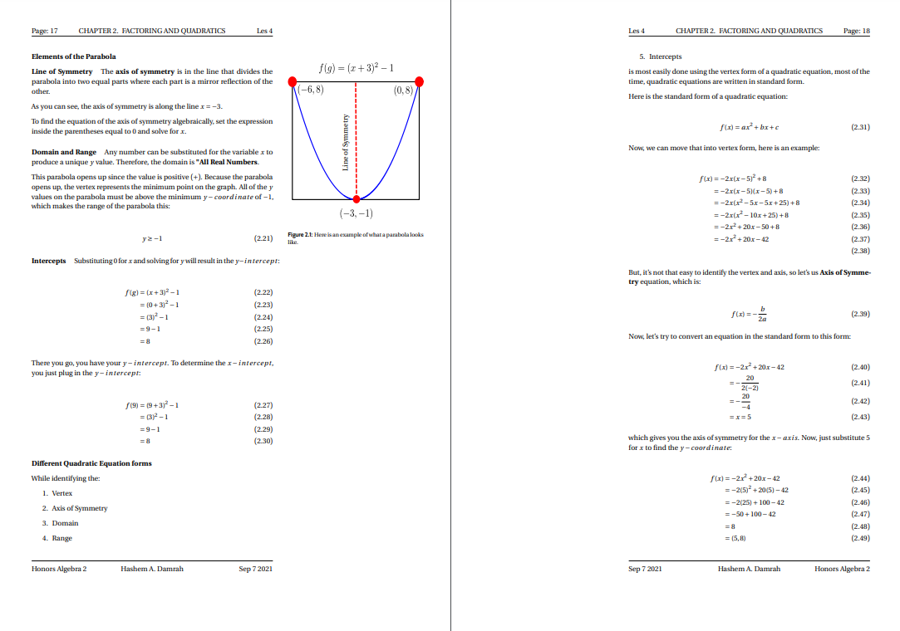

For a **very long time**, I have been trying to create the perfect setup for
note taking in general (but more specifically, for **math**). Before, I used to
use <a class="center after" href="https://www.notion.com">notion</a> to take my
notes, which was okay, but I wanted something much more productive. And thus,
my system was **BORN**!

Here are how some of my notes look like:




If you want to see how my completed notes look like, visit
<a class="center after" href="https://www.damrah.netlify.app/notes">here</a>.
I also store all of my notes
<a class="center after" href="https://www.github.com/SingularisArt/notes">here</a>.

I created this method during the summer of my **10th year** in school. I am
preparing my self for when I go to university. So I set myself **4** goals and
these goals must be met for me to use the system.

They are:

* Writing mathematical equations as fast (or faster) than my professor was an
  **A MUST**.
* Drawing the figures must be as **easy**, **fast**, and **simple**.
* It must feel like I am writing them on paper.
* My notes are very easily
  **manageable** and easy to **access**.

I will eventually have a ton of posts talking about this specific subject, but
for now, I will go over **Step 1**.

## NeoVim and LaTeX

**NeoVim** is a terminal-based text editor. It's just a better version of Vim,
which was made back in the 60s (I think).

I literally use NeoVim for everything. (You can find my custom NeoVim config
<a class="center after" href="https://www.github.com/SingularisArt/Death.NeoVim">here</a>).

**LaTeX** is a markup language used by mostly professors who want to publish
their papers. Also, nerds like me, spend countless weeks trying to figure out
the perfect setup for note-taking. Luckily, for you, you won't have to figure
anything out because I've done all of that for you.

Now, with that out of the way, here is what my screen looks like when I am
working with LaTeX:


On the left side, I have my editor (**NeoVim**) and on the right side, I have
my pdf viewer **Zathura**.

Here is a quick list of all of my utilities:

* OS (Operating System):
  <a class="center after" href="https://www.archlinux.org/">**Arch Linux**</a>
* WM (Window Manager):
  <a class="center after" href="https://www.dwm.suckless.org/">**DWM**</a>
* Text Editor:
  <a class="center after" href="https://www.github.com/neovim/neovim">**NeoVim**</a>
* Pdf Viewer:
  <a class="center after" href="https://www.github.com/pwmt/zathura">**Zathura**</a>

I have a huge list of plugins that you can view
<a class="center after" href="https://github.com/SingularisArt/Death.NeoVim/tree/master/pack/bundle/opt">here</a>),
but the plugin that I use for **LaTeX** is
<a class="center after" href="https://www.github.com/lervag/vimtex">vimtex</a>.
It provides:

* Syntax highlighting
* Auto compiling
* Renaming entire environments
* Shows you the toc (Table of Contents)

But, before I talk about how I configure NeoVim for **LaTeX**, let me explain to
you how I setup my NeoVim. This won't be an in depth tutorial (that will be in a
different post.)

For installing my plugins, I don't use a package manager.
I use **Git Submodules**. Here's an example:

```bash
git submodule add --name "vimtex" https://github.com/lervag/vimtex pack/bundle/opt/vimtex/
```

If you look at my
<a class="center after" href="https://github.com/SingularisArt/Death.NeoVim/blob/master/.gitmodules">.gitmodules</a>.
you can see all of my plugins.

If you install plugin this way, they won't load. You have to load it yourself.
Here's how I do it:

```lua
local autoload = function(base)
  local storage = {}
  local mt = {
    __index = function(_, key)
      if storage[key] == nil then
        storage[key] = require(base .. '.' .. key)
      end
      return storage[key]
    end
  }

  return setmetatable({}, mt)
end

return autoload
```

Put this in: `lua/github-username/autoload.lua`. Then, add this in your `lua/github-username/init.lua`:

```lua
local autoload = require('github-username.autoload')

local github-username = autoload('github-username')

-- Using a real global here to make sure anything stashed in here (and
-- in `SingularisArt.g`) survives even after the last reference to it goes away.
_G.github-username = github-username

return github-username
```

Replace `github-username` with your GitHub username. What it's doing is it's
calling all of my configuration files within my `lua/SingularisArt` directory,
then returning them for me to access them in my main `init.lua`.

Now, here's how I call each plugin:

```lua
if vim.o.loadplugins then
  ...
  SingularisArt.plugin.load("vimtex")
  ...
end
```

This is just calling the plugin, which is stored in `pack/bundle/opt`. If you
don't want to have a plugin load, then just comment out the line that calls it,
and it won't be called.

Now, back to **LaTeX**, I use a gazillion plugins (You can view them all
<a class="center after" href="https://github.com/SingularisArt/Death.NeoVim/blob/master/lua/core/plugins.lua">here</a>),
but the most powerful one for **LaTeX** users is 
<a class="center after" href="https://www.github.com/lervag/vimtex">VimTex</a>.

I'm going to assume that you already know how to install plugins and you already have a plugin manager.
If you haven't already, go ahead and install the **VimTex** plugin.

Now, time to configure it. Add this to your `init.vim` or `.vimrc`:

```viml
let g:vimtex_view_method='zathura'
let g:tex_flavor='latex'
set conceallevel=1
```

The first line tells **VIMTEX** what pdf viewer you want to use to open your
pdf. Simple. The next line tells what kind of **LaTeX** you want to use to
compile your document. The last line tell NeoVim to configure the concealment
level.

This is a feature that NeoVim uses to hide certain parts of the code if your
cursor isn't on it. It hides **\\[**, **\\]**, **$**. By making **\\[**,
**\\]**, **$** invisible, they aren't so distracting. Here's a quick demo:



## Snippets

### What are Snippets

One of the major reasons why I'm so fast at typing when it comes to **LaTeX**,
is because of **snippets**.

A snippet is a short reusable piece of text that can be triggered by some other
text.

Then, you have **snippet managers**, which manages the **snippets** that you make.
There are many snippet managers out there, but I use
<a class="center after" href="https://www.github.com/SirVer/ultisnips">UltiSnippets</a>
as my **snippet manager**.

Now, you can have certain kind of **snippets** for certain kinds of languages.
For example, you might have **snippets** for python, while having different
**snippets** for **LaTeX**.

You can take a look over
<a class="center after" href="https://www.github.com/SingularisArt/Death.NeoVim/blob/UltiSnippets/tex.snippets">VimTehere</a>
to see all of my **LaTeX snippets**, but I will be going over the most
important ones in this article.

### Installing Snippets

Like before, go ahead and install these plugins:

```
https://github.com/SirVer/ultisnips
https://github.com/honza/vim-snippets
https://github.com/hrsh7th/nvim-cmp
```

The first plugin (`ultisnips`) is the snippet manager.
The second plugin (`vim-snippets`) has all of the UltiSnips snippets.
The third plugin (`nvim-cmp`) is a completion engine.

Here's a quick demo using all of these three plugins:

You're gonna have to create a directory called: `after/plugin/`.
This is where you're going to put your configuration in. The reason you put all
of your plugin configuration here is because NeoVim will run all of the .lua
files within this directory. This means you don't have to manually require each
file.

Create a file called `after/plugin/cmp.lua` and place this configuration in it.

```lua
vim.cmd([[set completeopt=menuone,noinsert,noselect]])

local cmp_status, cmp = pcall(require, "cmp")

if not cmp_status then
	vim.notify("Please Install 'cmp'")
	return
end

local kind_icons = {
  Class = " ",
  Color = " ",
  Constant = "ﲀ ",
  Constructor = " ",
  Enum = "練",
  EnumMember = " ",
  Event = " ",
  Field = " ",
  File = "",
  Folder = " ",
  Function = " ",
  Interface = "ﰮ ",
  Keyword = " ",
  Method = " ",
  Module = " ",
  Operator = "",
  Property = " ",
  Reference = " ",
  Snippet = " ",
  Struct = " ",
  Text = " ",
  TypeParameter = " ",
  Unit = "塞",
  Value = " ",
  Variable = " ",
}

Vscode = vim.lsp.protocol.make_client_capabilities()

local source_mapping = {
  nvim_lsp = "(LSP)",
  nvim_lua = "(Lua)",
  latex_symbols = "(LaTeX)",
  ultisnips = "(Snippet)",
  cmp_tabnine = "(TabNine)",
  calc = "(Calculator)",
  gh_issues = "(Issues)",
  path = "(Path)",
  buffer = "(Buffer)",
  emoji = "(Emoji)",
  spell = "(Spell)",
}

Capabilities = require("cmp_nvim_lsp").update_capabilities(vim.lsp.protocol.make_client_capabilities())
Vscode.textDocument.completion.completionItem.snippetSupport = true

cmp.setup({
  snippet = {
    -- REQUIRED - you must specify a snippet engine
    expand = function(args)
      vim.fn["UltiSnips#Anon"](args.body) -- For `ultisnips` users.
      --require('luasnip').lsp_expand(args.body) -- For `luasnip` users.
      -- require('snippy').expand_snippet(args.body) -- For `snippy` users.
    end,

  enabled = function()
    local lnum, col = vim.fn.line('.'), math.min(vim.fn.col('.'), #vim.fn.getline('.'))
    for _, syn_id in ipairs(vim.fn.synstack(lnum, col)) do
      syn_id = vim.fn.synIDtrans(syn_id) -- Resolve :highlight links
      if vim.fn.synIDattr(syn_id, 'name') == 'Comment' then
        return false
      end
    end
    return true
  end,
  },

  mapping = {
    ["<C-y>"] = cmp.config.disable, -- Specify `cmp.config.disable` if you want to remove the default `<C-y>` mapping.
    ["<C-k>"] = cmp.mapping.select_prev_item(),
    ["<C-j>"] = cmp.mapping.select_next_item(),
    ["<A-p>"] = cmp.mapping.scroll_docs(-4),
    ["<A-n>"] = cmp.mapping.scroll_docs(4),
    ["<C-b>"] = cmp.mapping(cmp.mapping.complete(), { "i", "c" }),
    ["<CR>"] = cmp.mapping.confirm({ select = true }),
    ["<C-e>"] = cmp.mapping({
      i = cmp.mapping.abort(),
      c = cmp.mapping.close(),
    }),
  },

  documentation = {
    border = { "╭", "─", "╮", "│", "╯", "─", "╰", "│" },
  },

  sources = cmp.config.sources({
    { name = "nvim_lsp" },
    { name = "nvim_lua" },
    { name = "latex_symbols" },
    { name = "ultisnips" },
    { name = "cmp_tabnine" },
    { name = "calc" },
    { name = "gh_issues" },
    { name = "path" },
    { name = "buffer" },
    { name = "emoji" },
    { name = "spell" },
  }),

  experimental = {
    native_menu = false,
    ghost_text = true,
  },

  formatting = {
    format = function(entry, vim_item)
      vim_item.kind = kind_icons[vim_item.kind]
      local menu = source_mapping[entry.source.name]
      if entry.source.name == "cmp_tabnine" then
        if entry.completion_item.data ~= nil and entry.completion_item.data.detail ~= nil then
          menu = entry.completion_item.data.detail .. " " .. menu
        end
        vim_item.kind = ""
      end
      vim_item.menu = menu
      return vim_item
    end,
  },
})

cmp.setup.cmdline(":", {
  sources = {
    { name = "cmdline" },
  },
})

local Job = require("plenary.job")

local source = {}

source.new = function()
  local self = setmetatable({ cache = {} }, { __index = source })

  return self
end

source.complete = function(self, _, callback)
  local bufnr = vim.api.nvim_get_current_buf()

  -- This just makes sure that we only hit the GH API once per session.
  --
  -- You could remove this if you wanted, but this just makes it so we're
  -- good programming citizens.
  if not self.cache[bufnr] then
    Job
      :new({
        -- Uses `gh` executable to request the issues from the remote repository.
        "gh",
        "issue",
        "list",
        "--limit",
        "1000",
        "--json",
        "title,number,body",

        on_exit = function(job)
          local result = job:result()
          local ok, parsed = pcall(vim.json.decode, table.concat(result, ""))
          if not ok then
            vim.notify "Failed to parse gh result"
            return
          end

          local items = {}
          for _, gh_item in ipairs(parsed) do
            gh_item.body = string.gsub(gh_item.body or "", "\r", "")

            table.insert(items, {
              label = string.format("#%s", gh_item.number),
              documentation = {
                kind = "markdown",
                value = string.format("# %s\n\n%s", gh_item.title, gh_item.body),
              },
            })
          end

          callback { items = items, isIncomplete = false }
          self.cache[bufnr] = items
        end,
      })
      :start()
  else
    callback { items = self.cache[bufnr], isIncomplete = false }
  end
end

source.get_trigger_characters = function()
  return { "#" }
end

source.is_available = function()
  return vim.bo.filetype == "gitcommit"
end
```



Next section, I will go over how to add/modify snippets yourself.

### Adding Snippets

To add snippets, you first must configure `UltiSnips` itself. Now, add this to
you're `init.vim` or `.vimrc`:

```viml
let g:UltiSnipsExpandTrigger='<tab>'
let g:UltiSnipsJumpForwardTrigger='<tab>'
let g:UltiSnipsJumpBackwardTrigger='<s-tab>'

let g:UltiSnipsEditSplit='vertical'

let g:UltiSnipsSnippetDirectories=['~/.config/nvim/UltiSnips/']
```

Let's go over these quickly. The first line is telling `UltiSnips` what button
you want to use to expand the actual snippet. After you have expanded the
snippet, you have placeholders.

On line 2-3, you are telling `UltiSnips` what key presses you want to use to jump
back and forth between those placeholders.

The 4th line is telling `UltiSnips` to open the file vertically when you run
`:UltiSnipsEdit`.

The last and final line tells `UltiSnips` where to find your snippets.

#### Creating your own Snippets

Place your snippets in `~/.config/nvim/UltiSnips/` or wherever you told
`UltiSnips` to find theme. Each language has it's own specific snippet file. For
example, python snippets will be located at
`~/.config/nvim/UltiSnips/python.snippets`.

Or, instead of manually creating that file, open a file with that extension. For
example: `test.py`. Then, inside that file, type `:UltiSnipsEdit`. That will
create the file `~/.config/nvim/UltiSnips/python.snippets` for you.

Here is a basic skeleton for a snippet:

```viml
snippet SNIPPET NAME "SNIPPET DESCRIPTION"
...
endsnippet
```

To add placeholders, do this:

```viml
snippet document "Creates a document"
Document Name: $1
$0
endsnippet
```

The `$1` and `$0` are where your placeholders will be. The `$0` is always the
final placeholder. Now, you can create information within the placeholders like
this:

```viml
snippet document "Creates a document"
Document Name: ${1:DOCUMENT NAME}
$0
endsnippet
```

Now, the placeholder says **DOCUMENT NAME**, and when you reach that
placeholder, it will be highlighted in visual mode, and you can overwrite it.

Now you know the basics, let's get into some examples.

The code for this is probably the simplest.



Here is the snippet code for it:

```viml
snippet sign "Signature"
Yours sincerely,

Hashem A. Damrah
endsnippet
```

You can also run shell commands inside snippets, but you have to use back ticks
(\`\`) for that.



Here is the snippet code for it:

```viml
snippet date-time "Today's date and Current Time"
`date "+%b %d %Y %a %R`
endsnippet
```

You can even combine snippets:

TODO: Add combine

## LaTeX Snippets

### Environments

To insert an environment, all I have to do is type **beg**. I created this
snippet in a special manner. It only triggers whenever it's the first word
typed on the line. Also, you don't need to hit **TAB** because it will
automatically expand for you.

You start typing out what kind of environment you want. Then, once you're done,
hit tab. That will move you into the environment.

```viml
snippet beg "begin{} / end{}" bAi
\begin{$1}
	${VISUAL}$2
\end{$1}$0
endsnippet
```



Now, I have a ton of different environments that I commonly use. So, like the
good programmer I am, I decided to waste even more time creating specific
snippets for each environment:



Now, sometimes you may want to surround specific text with the environment. So,
what do you do? You can remove the text, create the environment, then paste.
That feels **WRONG**. As you all know, us programmers are the laziest people.
We spend hours trying to configure something to save us a couple of minutes.
And, guess what? That's exactly what I did. I read through the documentation to
learn about this (which took about 1.5 hours.)

It's called visual select tab. You highlight whatever you want, hit tab, then
go ahead and activate the snippet. There you go, the code you highlighted is
know surrounded with the environment you want!

```viml
snippet doc "Document" bAi
\begin{document}
	${VISUAL}$1
\end{document}$0
endsnippet

snippet cnt "Center" bAi
\begin{center}
	${VISUAL}$1
\end{center}$0
endsnippet

snippet desc "Description" bAi
\begin{description}
	${VISUAL}$1
\end{description}$0
endsnippet

snippet lemma "Lemma" bAi
\begin{lemma}
	${VISUAL}$1
\end{lemma}$0
endsnippet

snippet prop "Proposition" bAi
\begin{prop}[$1]
	${VISUAL}$2
\end{prop}$0
endsnippet

snippet thrm "Theorem" bAi
\begin{theorem}[$1]
	${VISUAL}$2
\end{theorem}$0
endsnippet

snippet post "postulate" bAi
\begin{postulate}[$1]
	${VISUAL}$2
\end{postulate}$0
endsnippet

snippet prf "Proof" bAi
\begin{proof}[$1]
	${VISUAL}$2
\end{proof}$0
endsnippet

snippet def "Definition" bAi
\begin{definition}[$1]
	${VISUAL}$2
\end{definition}$0
endsnippet

snippet nte "Note" bAi
\begin{note}[$1]
	${VISUAL}$2
\end{note}$0
endsnippet

snippet prob "Problem" bAi
\begin{problem}[$1]
	${VISUAL}$2
\end{problem}$0
endsnippet

snippet corl "Corollary" bAi
\begin{corollary}[$1]
	${VISUAL}$2
\end{corollary}$0
endsnippet

snippet exm "Example" bAi
\begin{example}[$1]
	${VISUAL}$2
\end{example}$0
endsnippet

snippet ntn "Notation" bAi
\begin{notation}[$1]
	${VISUAL}$2
\end{notation}$0
endsnippet

snippet rep "Repetition" bAi
\begin{repetition}[$1]
	${VISUAL}$2
\end{repetition}$0
endsnippet

snippet prop "Property" bAi
\begin{property}[$1]
	${VISUAL}$2
\end{property}$0
endsnippet

snippet int "Intuition" bAi
\begin{intuition}[$1]
	${VISUAL}$2
\end{intuition}$0
endsnippet

snippet obs "Observation" bAi
\begin{observation}[$1]
	${VISUAL}$2
\end{observation}$0
endsnippet

snippet conc "Conclusion" bAi
\begin{conclusion}[$1]
	${VISUAL}$2
\end{conclusion}$0
endsnippet

snippet enum "Enumerate" bAi
\begin{enumerate}
	\item ${VISUAL}$1
\end{enumerate}$0
endsnippet

snippet item "Itemize" bAi
\begin{itemize}
	\item ${VISUAL}$1
\end{itemize}$0
endsnippet

snippet case "cases" bAi
\begin{cases}
	${VISUAL}$1
\end{cases}$0
endsnippet

snippet ali "Align*" bAi
\begin{align*}
	${VISUAL}$1
.\end{align*}$0
endsnippet

snippet ali "Align" bAi
\begin{align}
	${VISUAL}$1
.\end{align}$0
endsnippet

snippet eqt "Equation" bAi
\begin{equation}
	\begin{split}
		${VISUAL}$1
	\end{split}
.\end{equation}$0
endsnippet

snippet fig "Figure environment" bAi
\begin{figure}[${1:htpb}]
	\centering
	${2:\includegraphics[width=0.8\textwidth]{$3}}
	\caption{${4:$3}}
	\label{fig:${5:${3/\W+/-/g}}}
\end{figure}$0
endsnippet

snippet tkz "Tikz pgfplot" bAi
endsnippet

snippet tab "tabular / array environment" bAi
	\begin{${1:t}${1/(t)$|(a)$|(.*)/(?1:abular)(?2:rray)/}}{${2:c}}
		$0${2/(?<=.)(c|l|r)|./(?1: & )/g}
	\end{$1${1/(t)$|(a)$|(.*)/(?1:abular)(?2:rray)/}}$0
endsnippet

snippet tbl "Table environment" bAi
\begin{table}[${1:htpb}]
	\centering
	\caption{${2:caption}}
	\label{tab:${3:${2/\\\w+\{(.*?)\}|\\(.)|(\w+)|([^\w\\]+)/(?4:_:\L$1$2$3\E)/ga}}}

	\begin{${4:t}${4/(t)$|(a)$|(.*)/(?1:abular)(?2:rray)/}}{${5:c}}
		$0${5/(?<=.)(c|l|r)|./(?1: & )/g}
	\end{$4${4/(t)$|(a)$|(.*)/(?1:abular)(?2:rray)/}}
\end{table}$0
endsnippet

pre_expand "create_table(snip)"
snippet "gentbl(\d+)x(\d+)" "Generate table of *width* by *height*" wrAbi
endsnippet

pre_expand "add_row(snip)"
snippet "tr(\d+)" "Add table row of dimension ..." wrAbi
endsnippet
```

* The **b** means **If the trigger word is the first word on the line, and no
writing comes afterword, then expand**.
* The **A** means **Expand without the trigger key, just expand right after the
person types the trigger word**.

### Inline and Display Math

These are my two most frequency used snippets. They are responsible for bringing
me into math mode. They are `ilm` (Inline Math) and `dm` (Display Math).



```viml
snippet ilm "Inline Math" wA
$${VISUAL}$1$`!p
if t[2] and t[2][0] not in [',', '.', '?', '-', ' ']:
    snip.rv = ' '
else:
    snip.rv = ''
`$2
endsnippet

snippet dm "Display Math" wA
\[
	${VISUAL}$1
\].$0
endsnippet
```

The **A** at the end of the snippet declaration means it will expand as soon as
you type the key (`im`, `dm`). It doesn't wait for you to hit **tab**.

The **w** at the end of the first line means that this snippet will expand at
word boundaries. So, `helloim` won't expand, but `hello im` will.

The **b** means it won't expand unless it's at the beginning and the first word
on the line. So, `hello dm` won't expand, but `dm hello` will.

### Sub and Super scripts

#### Sub Scripts

Another handy snippet are these ones, which is used for sub scripts. It changes
a1 to a_1 and a_12 to a_{12} and a_{12}3 to a_{123}. It can also change
a_{123456789}0 to a_{1234567890}. Here, size doesn't matter!



The code for these snippets use regular expressions for there trigger. The
first expands if there is a variable, followed by a number. Example **b3** ->
**b_3**. Here is the snippet code:

```viml
snippet '([A-Za-z])(\d)' "Auto subscript" wrA
`!p snip.rv = match.group(1)`_`!p snip.rv = match.group(2)`
endsnippet
```

The second snippet checks if there is a variable, followed by an
underscore, followed by two numbers. Example b_34 -> b_{34}.
Here is the snippet code:

```viml
snippet '([A-Za-z])_(\d\d)' "Auto subscript 2" wrA
`!p snip.rv = match.group(1)`_{`!p snip.rv = match.group(2)`}
endsnippet
```

The last and final snippet checks if there is a variable, followed by an
underscore, followed by a group of {} with numbers inside. It also checks if
there is a number in front of the closing bracket. Example b_{34}5 -> b_{345}

Here is the snippet code:

```viml
snippet '([A-Za-z])_\{(\d+)\}(\d)' "Auto subscript 3+" wrA
`!p snip.rv = match.group(1)`_{`!p snip.rv = match.group(2) + match.group(3)`}
endsnippet
```

I also created a quick snippet that puts you in **subscript** mode:

```viml
snippet __ "Super Script" Aw
_{$1}$0
endsnippet
```

#### Super Scripts

As for the superscripts, I use **td** -> **^{}**. However, I use some quick
snippets for basic things like squaring, cubing, raising to a variable.
Here is a quick view of the snippets:

* **sq** -> **^2**
* **cb** -> **^3**
* **ss** -> **^\{\}**
* **rd** -> **^\{()\}**
* **compl** -> **^\{c\}**
* **invs** -> **^\{-1\}**



Here are the snippets:

```viml
snippet sq "Square" Aw
^2
endsnippet

snippet cb "Cube" Aw
^3
endsnippet

snippet ss "Super Script" Aw
^{$1}$0
endsnippet

snippet rd "To The ... Power" Aw
^{($1)}$0
endsnippet

snippet compl "Complement" Aw
^{c}
endsnippet

snippet invs "Inverse" Aw
^{-1}
endsnippet
```

### Fractions

These snippets, are the funniest and they give you a big satisfaction whenever
you pull them off.



Now, let's start off with something very easy. Creating a simple fraction:

```viml
snippet // "Fraction" iA
\frac{$1}{$2}$0
endsnippet
```

The core of the second snippet is regular expressions. It's used to match
expressions like:
* \pi^{2}/
* 39_{9\Theta}/
* cf_2
* etc

```viml
snippet '((\d+)|(\d*)(\\)?([A-Za-z]+)((\^|_)(\{\d+\}|\d))*)/' "Fraction" wrA
\\frac{`!p snip.rv = match.group(1)`}{$1}$0
endsnippet
```

In the fourth case, I tried to find matching parenthesis. But, all of the work
went in vain because you cannot with `UltiSnips`. So, I used Python :).

```viml
priority 1000
snippet '^.*\)/' "() Fraction" wrA
`!p
stripped = match.string[:-1]
depth = 0
i = len(stripped) - 1
while True:
	if stripped[i] == ')': depth += 1
	if stripped[i] == '(': depth -= 1
	if depth == 0: break;
	i -= 1
snip.rv = stripped[0:i] + "\\frac{" + stripped[i+1:-1] + "}"
`{$1}$0
endsnippet
```

The last section that I want to show you is your selection to make your own
fraction using **visual mode**.



```viml
snippet / "Fraction" iA
\\frac{${VISUAL}}{$1}$0
endsnippet
```

### Context


The number one problem that I had when I first started using UltiSnips was:
**My snippets kept colliding with me writing text.**

For example, let's say you're typing `newsroom`. Since it has `sr`, this will
expand to `\sqrt{}`, which will result in `new\\sqrt{}oom`.

The solution to keep this from happening is to use something called `context`.
This will help us determine if we are in the correct environment to expand the
snippet. Here's the code for it:

```snippets
global !p
def math():
	return vim.eval('vimtex#syntax#in_mathzone()') == '1'

def not_math():
	return vim.eval('vimtex#syntax#in_mathzone()') == '0'

def comment(): 
	return vim.eval('vimtex#syntax#in_comment()') == '1'

def env(name):
	[x,y] = vim.eval("vimtex#env#is_inside('" + name + "')") 
	return x != '0' and y != '0'
endglobal
```

Now we can add `context math()` to the snippets you would like to expand only
in math mode.

```snippets
context "math()"
snippet sr "Square root" iA
\sqrt{$1}$0
endsnippet
```



### School lessons

I don't really use these that often because I created scripts that do a lot of
work when:

* Organizing
* Changing
* Switching
* Loading
* Reloading

Between:

* Classes
* Lessons
* Lectures

You can find these scripts 
<a class="center after" href="https://www.github.com/SingularisArt/Singularis/tree/master/local/scripts/school">here</a>,
but eventually, I will create a blog post about how I made those scripts, how I
use them, etc.



```viml
snippet les "Lesson"
\lesson{${1:LESSON NUMBER}}{\`date "+%b %d %Y %a (%H:%M:%S)"\`}{${3:LESSON NAME}}
$0
endsnippet

snippet lec "Lecture"
\lecture{${1:LECTURE NUMBER}}{\`date "+%b %d %Y %a (%H:%M:%S)"\`}{${3:LECTURE NAME}}
$0
endsnippet
```

### Correct spelling mistakes

I use this a **TON**. It's so handy because I don't have to leave insert mode,
hover over the word, press **z=**, select the correct word, then go all the way
back. UHHH, that was a lot of work! Also, if the word isn't corrected
correctly, I can exit insert mode, press **u**, and select the correct word,
and from now on, it will always be corrected to the correct one, which is the
one that I chose. AMAZING!



Now, put this in your `init.vim` or `.vimrc`:

```viml
setlocal spell
set spelllang=en
inoremap <C-l> <C-g>u<Esc>[s1z=`]a<C-g>u
```

## Auto completion

Now, besides `snippets` helping me out a ton when taking notes, I also have
`autocompletion`.

This is possible by using
<a class="center after" href="https://en.wikipedia.org/wiki/Language_Server_Protocol">LSP</a>.
`LSP` is a `language server protocol`, which allows me to get autocompletion,
suggestions, etc based on the language that I'm using.

### Setting LSP in NeoVim

We first need to install these plugins:

```lua
https://github.com/neovim/nvim-lspconfig
https://github.com/onsails/lspkind-nvim
https://github.com/tami5/lspsaga.nvim (Branch name: nvim51)
https://github.com/williamboman/nvim-lsp-installer
```

### Install your language server

Installing your language server is super easy. For a complete list of all of
the language servers NeoVim offers, head over
<a class="center after"
href="https://github.com/neovim/nvim-lspconfig/blob/master/doc/server_configurations.md">here</a>.
To install your language server, just run `:LspInstall [lang name]`. Now, you
have your language server installed in NeoVim.

But, you need to server installed on your computer. To do that, head over
<a class="center after"
href="https://github.com/neovim/nvim-lspconfig/blob/master/doc/server_configurations.md">here</a>
and find your language. Follow the link that they provide and install it from
there.

For example, I want to have the `python` language server. So, I just run
`:LspInstall python` in NeoVim. Then, I run `pip3 install
'python-lsp-server[all]'`. Now, I have my server.

To activate it `python`, put this in your `init.lua`:

```lua
require('lspconfig').pylsp.setup{}
```

But, for me, I have a ton of servers, and my goal is to only keep them growing.
So, here is a better way of doing it:

```lua
-- LSP Servers to install

local capabilities = require('cmp_nvim_lsp').update_capabilities(vim.lsp.protocol.make_client_capabilities())

local langservers = {
  'sumneko_lua',      -- Lua
  'vimls',            -- Vim
  'texlab',           -- LaTeX
  'pylsp',            -- Python
  'bashls',           -- Bash
  'clangd',           -- C++,C
  'omnisharp',        -- C#
  'cmake',            -- CMake
  'html',             -- HTML
  'cssls',            -- CSS
  'jsonls',           -- JSON
  'rust_analyzer',    -- Rust
  'tsserver',         -- Typescript/Javascript
  'yamlls',           -- Yaml
  'solc',             -- Solidity
  'solang',           -- Solidity
  'solidity_ls',      -- Solidity
  'dockerls',         -- Docker
}

for _, server in ipairs(langservers) do
  if server == 'sumneko_lua' then
    require('lspconfig')[server].setup {
      capabilities = capabilities,
      settings = {
        Lua = {
          diagnostics = {
            globals = { 'vim', 'use' }
          },
        }
      }
    }
  else
    require('lspconfig')[server].setup { capabilities = capabilities }
  end
end
```

Inside of the `local langservers`, just add your server name and you're good to
go. For example, if I want to have the rust language server, just add
`rust_analyzer` to the langservers.

Again, you can get this information from
<a class="center after" href="https://github.com/neovim/nvim-lspconfig/blob/master/doc/server_configurations.md">here</a>.

#### Installing the Server for LaTeX

Since we're using NeoVim to take notes using `LaTeX`, then let's install the
`LaTeX` language server, which is `texlab`. You can view the source code
<a class="center after" href="https://github.com/latex-lsp/texlab">here</a>.
To install it, run the following command:

```bash
cargo install --git https://github.com/latex-lsp/texlab.git --locked
```

Now, add this line to your `init.lua`:

```lua
require('lspconfig').texlab.setup{}
```

Now, when you type `\`, you will be able to see autocompletion.

### Demo of LSP



## Credit

I would like to give a thanks 👏 to
<a class="center after" href="https://www.castel.dev">Gilles Castel</a>
for teaching me all of this stuff. I would recommend to go and checkout his
website!

## Conclusion

So, I have just proven to you that you can write **LaTeX**

* **fast**
* **easily**
* **efficiently**

Stay tuned to learn about how I:

* **draw figures**
* **manage my notes**
* **take notes**

