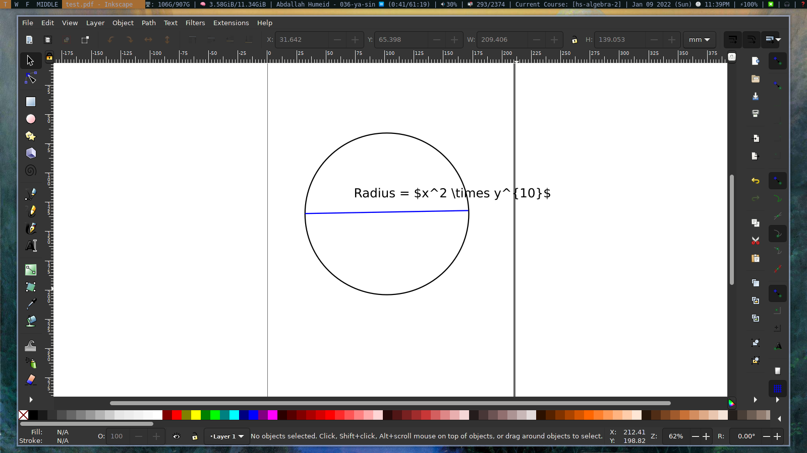
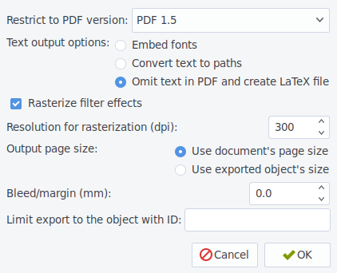
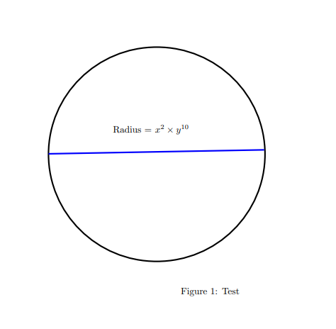

In my [previous blog](https://damrah.netlify.app/post/note-taking-with-latex-part-1/)
post, I explained how I take notes using NeoVim and LaTeX. In this post,
I’ll talk about how I draw figures for my notes using Inkscape.

## What is Inkscape?

<a class="center after" href="https://inkscape.org/">Inkscape</a> is an
open-source vector graphics editor. It's available for all major platforms, let
it be:

* **Windows**
* **Mac**
* **Linux**

It's a free program, but when you compare it to the likes of **Adobe
Illustrator**, you will see that it's lacking some things. But, it's perfect for
drawing mathematical figures.

## Why Inkscape?

The most common solutions for adding figures in LaTeX are using the packages:

* **TikZ**
* **PSTricks**
* **Asymptote**

All of these options have one thing in common, which is they are all command
based, meaning you must write some code that specifies how the figure should be
drawn. Here's an example:

```latex
\begin{tikzpicture}
    \coordinate (A) at (1, 3);
    \draw[thick, ->] (0, 0) -- (A);
    \node[above right] at (A) {$A = (1, 2)$};
\end{tikzpicture}
```

Which gives you this graph:


The benefits of using these packages is that drawing a figure is a lot like
programming. You can:

* Use Variables
* Use for loops
* Do Calculations
* Etc ...

Also, figures blend in nicely in your document because all text is typeset for
**LaTeX** itself. This means that you can typeset math effortlessly. Also, you
can change the figure on the fly. If you want to change the font, font size, you
can do it without opening a program like **Inkscape**.

However, using these packages costs you visual feedback and speed. Drawing
complex figures is a cumbersome task, especially when hard coding the figure.
It's much easier to draw the needed figures using a program dedicated to drawing
figures, such as **Inkscape**.

With this out of the way, let’s get started.

## Including figures

Just like **TikZ**, **Inkscape** has the option to render the text of a figure
using LaTeX. For this, it exports figures as both a **pdf** and a LaTeX file.
The **pdf** document contains the figure with the text stripped, and the LaTeX
document contains the code needed to place the text at the correct position. For
example, let's say you're working on this figure in Inkscape:



To include this figure in your LaTeX document, you need to go to:

**File > Save As**, select `pdf` as the extension and then press `Save`. But
make sure that you save the document in `figures/` folder. That makes the
following show:




Choosing the `Omit Text in PDF and create LaTeX file` will save the figure as a
`PDF+LaTeX`. Here's how you include the figure in your LaTeX document.

```latex
\usepackage{import}
\usepackage{xifthen}
\usepackage{pdfpages}
\usepackage{transparent}

\newcommand{\incfig}[1]{%
  \def\svgwidth{\columnwidth}
  \import{./figures/}{#1.pdf_tex}
}
```

You can simply include the figure with the following code:

```latex
\begin{figure}[ht]
  \centering
  \incfig{test}
  \caption{Test Figure}
  \label{fig:test}
\end{figure}
```

Compiling your document, you’d get the following.



As you can see, the text is rendered by LaTeX which makes the figure blend in
beautifully. When you later decide to change the font, it gets up­dated
accordingly.

This setup al­lows you to draw figures in Inkscape, while still having the
power of LaTeX for typesetting.

## Creating and including figures quickly

When I'm taking notes, I want to be able to add a figure without distrupting my
workflow because when I'm in a state of mind, in which I'm working on school,
and then something takes long to respond, I start to drift off and start to do
other things. When I need to insert a figure, I don't want to open
Inkscape, create the figure, save it in the right location, name it correctly
and then insert it. **__No SIR__**. To avoid this, I added some short cuts to
NeoVim for managing my figures. For example, when I need to insert a figure, I
just type the name of the figure, then press `Ctrl+f`. This is what that mapping
does:

1. The script finds the figures directory depending on the location of
   the LaTeX root file.
2. Then it checks if a figure with the same name exists. If so, the script
   does nothing.
3. If not, my figure template gets copied to the figures directory.
4. The current line which contains the figure title gets replaced with the
   LaTeX code to include the figure.
5. The new figure opens in Inkscape.
6. A file watcher is set up such that whenever the figure is saved as an svg
   file by pressing `Ctrl+S`, it also gets saved as `pdf+LaTeX`. This means that
   the annoying pdf save dialog we’ve discussed be­fore doesn’t pop up
   any­more.


When I need to edit a figure, I press `Ctrl+F` in normal mode to open a
selection dialog, which allows me to search for figures in the current document.
Once I select one, it shows me the figure in inkscape. When I save the figure,
the code for including it is copied to the clipboard. This way, I can re-include
it if I deleted the original code to do so.

## Conclusion

Using Inkscape, draw­ing fig­ures for ar­ti­cles, books and pre­sen­ta­tions is
a breeze. They look pro­fes­sion­al and blend in nice­ly in your doc­u­ment.
While it’s slow­er than draw­ing them by hand, it’s faster than TikZ in most
cases.
