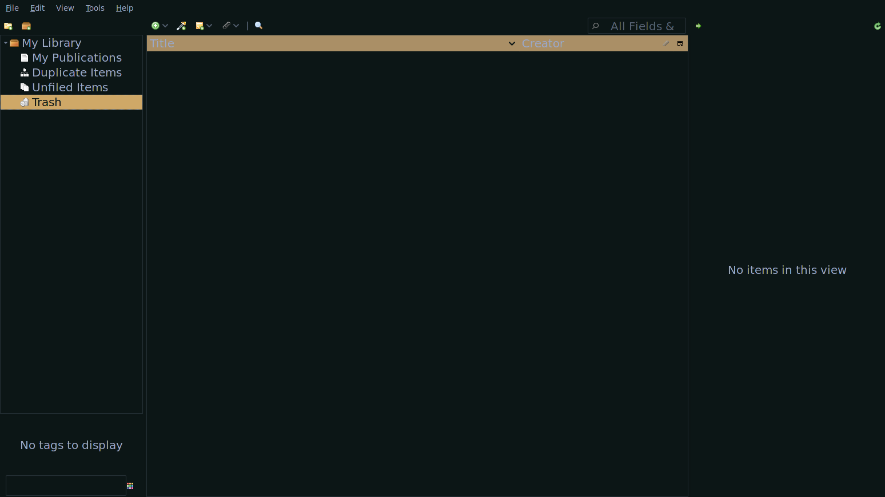

## Citation

### Download Zotero

For citation, you're going to need an extra tool. You're going to need the
program [Zotero](https://www.zotero.org/). Download this program. Then, create
an account with them. Don't worry, it's completely free, otherwise I wouldn't
have used it from the beginning.

This will help you create any citation for any:

* Website
* Book
* Movie

And you can choose any style you want. If you want **MLA** format, **Harvard**
format, etc. Let's go over a tutorial real quickly.

Here's how it looks like:



### Using Zotero

Now, to cite websites, you're going to need to download their google extension.
Download it from [here](https://chrome.google.com/webstore/detail/zotero-connector/ekhagklcjbdpajgpjgmbionohlpdbjgc?hl=en).

Open up the **Zotero** program. Go to **Edit > Preferences > Sync **. From
there, put in you're username and password from when you signed up with **Zotero**.

While still in the preferences, you can change the style of citation by clicking
the **Cite** section.

You can create citation by clicking the **+** icon and select the type.
You can also create different folders by left clicking the **My Library**
button. You can:

* Create Sub-Folder
* Delete Sub-Folder
* Sync

You can also cite from websites using the extension you downloaded earlier and
you can save the citation to a specific folder if you wish, but remember, all of
your citations will end up in the **My Library**, but copied to other
sub-folders.

Here's a quick demo of me using **Zotero**:


### Auto-Complete Citations

> Be aware, if you want citation autocompletion, you must first install **LSP**.
> <a class="center after" href="https://damrah.netlify.app/post/note-taking-with-latex-part-1/#auto-completion">here</a>
> for a guide on how to do that.

To download your citations, just left-click the folder, and select
**Export Collection**. But, make sure to save it as a **.bib** file.


Make sure to save it as `bibliography.bib` and place it in the folder with your
`master.tex` file. Here's an example of a `bibliography.bib` file using the
**MLA** format:

```bib
@misc{noauthor_mathematics_2022,
	title = {Mathematics},
	copyright = {Creative Commons Attribution-ShareAlike License},
	url = {https://en.wikipedia.org/w/index.php?title=Mathematics&oldid=1066575364},
	abstract = {Mathematics (from Greek: μάθημα, máthēma, 'knowledge, study, learning') includes the study of such topics as numbers (arithmetic and number theory), formulas and related structures (algebra), shapes and spaces in which they are contained (geometry), and quantities and their changes (calculus and analysis). There is no general consensus about its exact scope or epistemological status.Most of mathematical activity consists of discovering and proving (by pure reasoning) properties of abstract objects. These objects are either abstractions from nature (such as natural numbers or "a line"), or (in modern mathematics) abstract entities that are defined by their basic properties, called axioms. A proof consists of a succession of applications of some deductive rules to already known results, including previously proved theorems, axioms and (in case of abstraction from nature) some basic properties that are considered as true starting points of the theory under consideration. The result of a proof is called a theorem. Contrary to scientific laws, the validity of a theorem (its truth) does not rely on any experimentation but on the correctness of its reasoning (though experimentation is often useful for discovering new theorems of interest).
Mathematics is widely used in science for modeling phenomena. This enables the extraction of quantitative predictions from experimental laws. For example, the movement of planets can be predicted with high accuracy using Newton's law of gravitation combined with mathematical computation. The independence of mathematical truth from any experimentation implies that the accuracy of such predictions depends only on the adequacy of the model for describing the reality. So when some inaccurate predictions arise, it means that the model must be improved or changed, not that the mathematics is wrong. For example, the perihelion precession of Mercury cannot be explained by Newton's law of gravitation, but is accurately explained by Einstein's general relativity. This experimental validation of Einstein's theory shows that Newton's law of gravitation is only an approximation (which still is very accurate in everyday life). 
Mathematics is essential in many fields, including natural sciences, engineering, medicine, finance, computer science and social sciences.
Some areas of mathematics, such as statistics and game theory, are developed in direct correlation with their applications, and are often grouped under the name of applied mathematics. Other mathematical areas are developed independently from any application (and are therefore called pure mathematics), but practical applications are often discovered later. A fitting example is the problem of integer factorization which goes back to Euclid but had no practical application before its use in the RSA cryptosystem (for the security of computer networks).
Mathematics has been a human activity from as far back as written records exist. However, the concept of a "proof" and its associated "mathematical rigour" first appeared in Greek mathematics, most notably in Euclid's Elements. Mathematics developed at a relatively slow pace until the Renaissance, when algebra and infinitesimal calculus were added to arithmetic and geometry as main areas of mathematics. Since then the interaction between mathematical innovations and scientific discoveries have led to a rapid increase in the rate of mathematical discoveries. At the end of the 19th century, the foundational crisis of mathematics led to the systematization of the axiomatic method. This, in turn, gave rise to a dramatic increase in the number of mathematics areas and their fields of applications; a witness of this is the Mathematics Subject Classification, which lists more than sixty first-level areas of mathematics.},
	language = {en},
	urldate = {2022-01-19},
	journal = {Wikipedia},
	month = jan,
	year = {2022},
	note = {Page Version ID: 1066575364},
	file = {Snapshot:/home/hashem/Zotero/storage/NYDPEYFR/Mathematics.html:text/html},
}
```

If you want NeoVim to autocomplete your citations for you, make sure to add this
to your **master.tex**:

```tex
\bibliography{bibliography}
```

Once you've added that, once you type:

```tex
\cite{
```

You will start to get autocompletions. Here's a demo:


