For a **very long time**, I have been trying to create the perfect setup for
note taking in general (but more specifically, for **math**). Before, I used to
use [notion](https://www.notion.com) to take my

notes, which was okay, but I wanted something much more productive. And thus,
my system was **BORN**!

Here are how some of my notes look like:

<figure>
  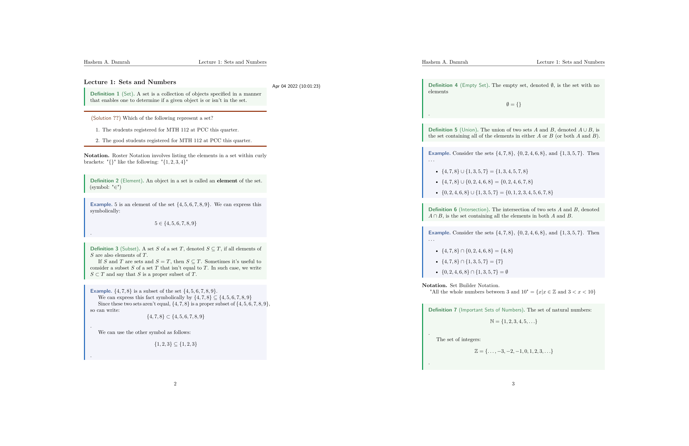
  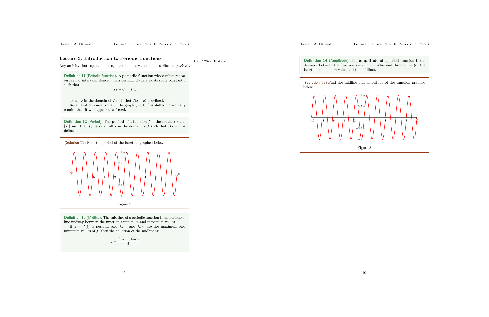
  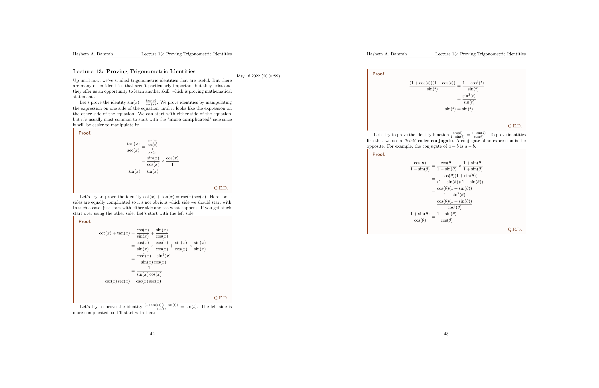
  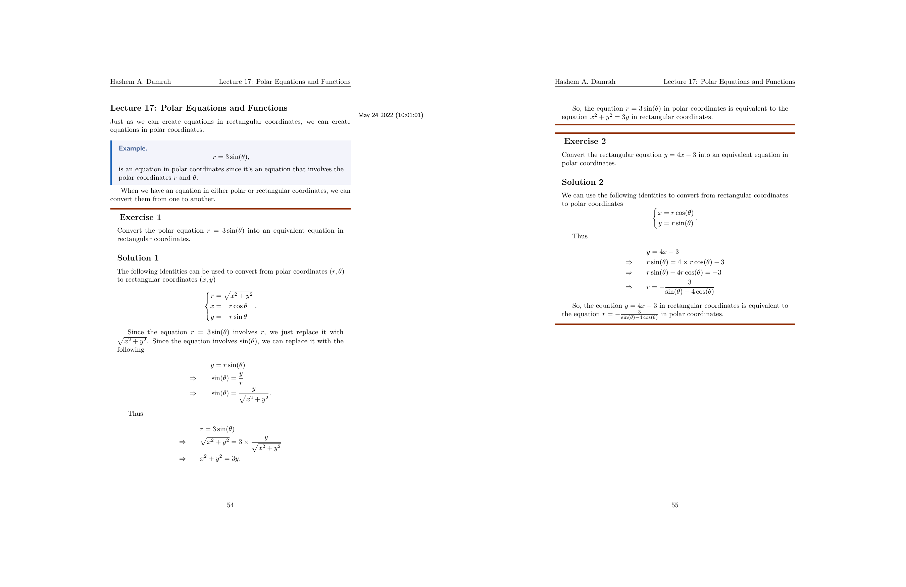
  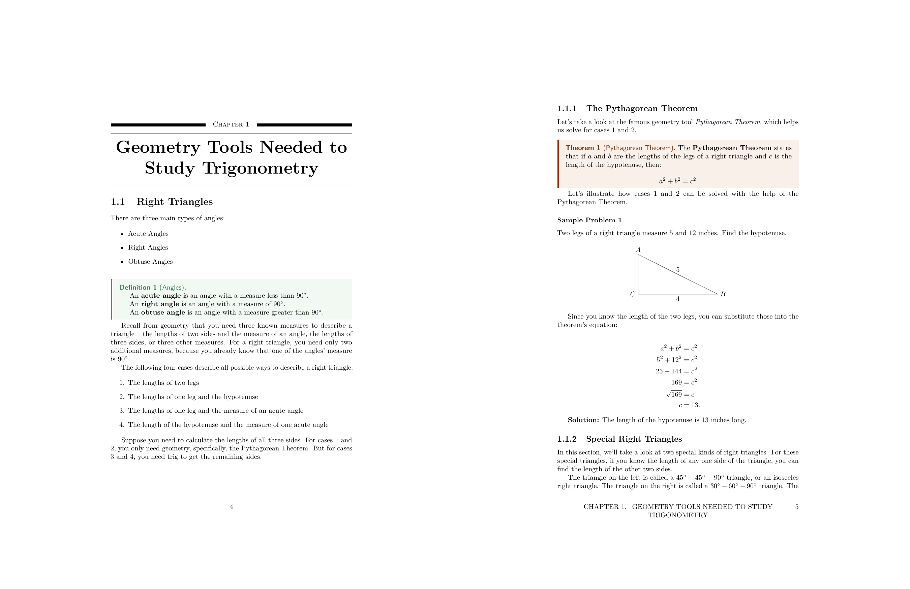
  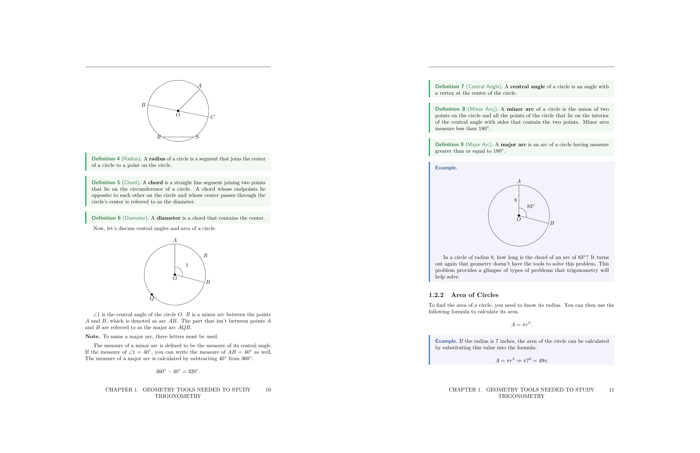
  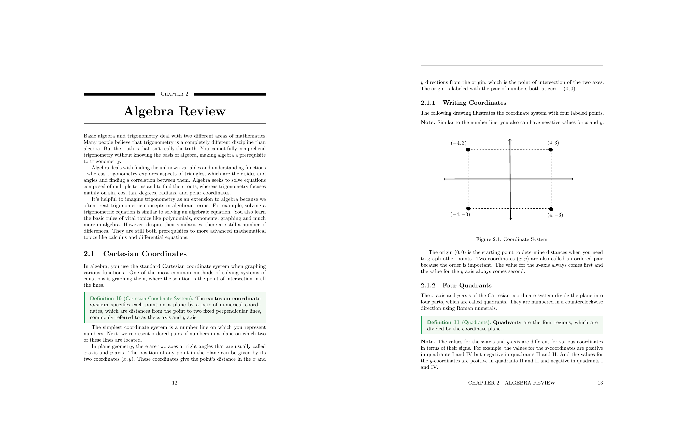
  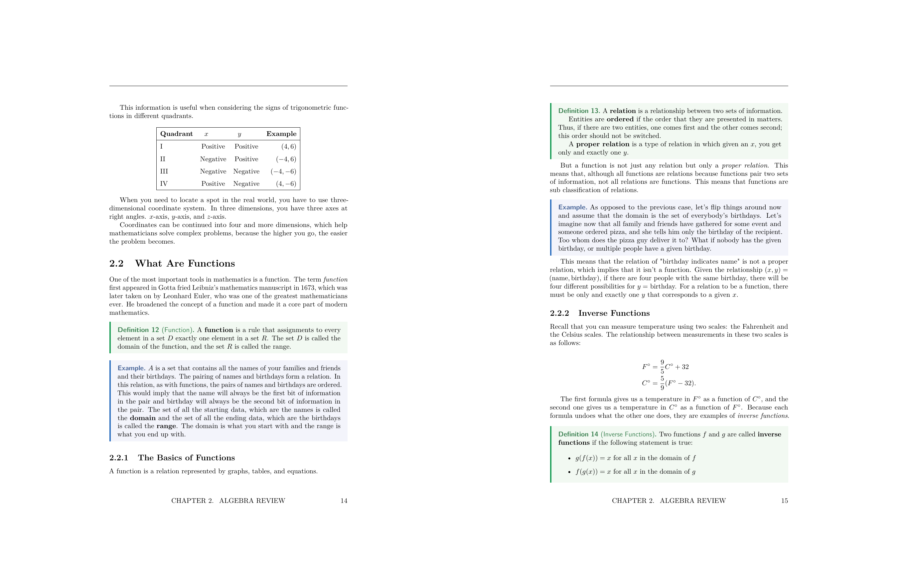
  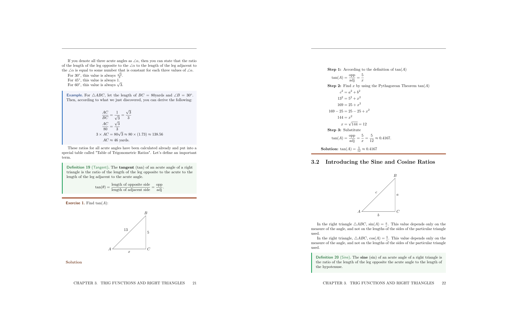
  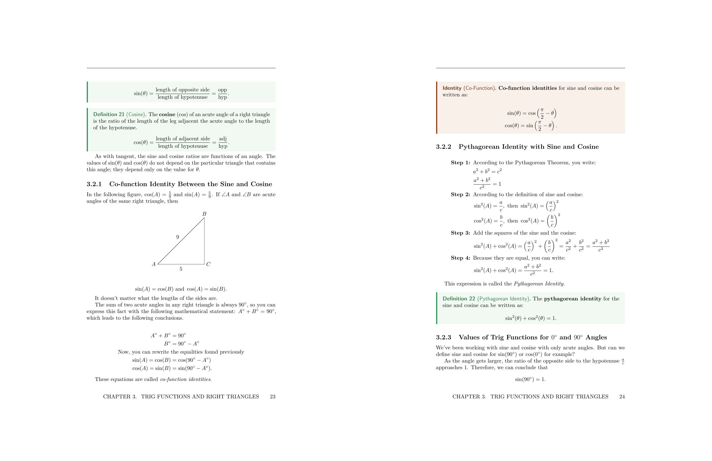
</figure>

You can look at my notes source code [here](https://damrah.netlify.app/notes).
I also store all my final notes
[here](https://www.github.com/SingularisArt/notes).

I created this method during the summer of my **10th year** in high school. I am
preparing my self for when I go to university. I set myself **4** goals.

- Writing mathematical equations must be **easier than writing them by hand**
  and **faster than my professor**.
- Creating and using citations must be **straightforward** and **easy**.
- Drawing figures must be as **easy**, **fast**, and **simple**.
- My notes are
  - **manageable**
  - **searchable**
  - **easy to access**
  - **no lag to switch between classes**

I will have a ton of posts talking about this specific subject, but
for now, I will go over **Step 1**.

# NeoVim and LaTeX

**NeoVim** is a terminal-based text editor. It's a better version of Vim.

I use NeoVim for everything. (You can find my custom NeoVim config
[here](https://www.github.com/SingularisArt/DeathVim).

**LaTeX** is a markup language used by professors who want to publish
their papers, which is unfortunate because it's a great tool to take notes on,
besides school. This setup took me about 1 year to make and it's still a
work in the progress. Luckily, for you, you won't have to figure anything out
because I've done everything for you.

Now, with that out of the way, here is what my screen looks like when I am
working with LaTeX:

<figure>
  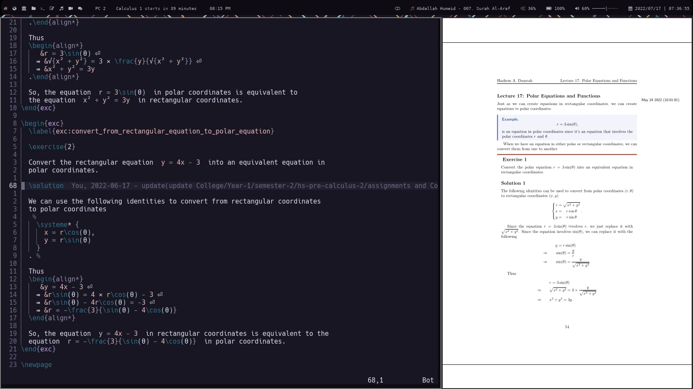
</figure>

On the left side, I have my editor (**NeoVim**) and on the right side, I have
my pdf viewer **Zathura**.

Here is a quick list of my utilities:

- OS (Operating System): [Arch Linux](https://www.archlinux.org).
- WM (Window Manager): [BSPWM](https://github.com/baskerville/bspwm).
- Text Editor: [NeoVim](https://www.github.com/neovim/neovim).
- Pdf Viewer: [Zathura](https://www.github.com/pwmt/zathura).
- Terminal Emulator: [Xfce4-Terminal](https://docs.xfce.org/apps/terminal/start).

You can view all my plugins [here](https://github.com/SingularisArt/DeathVim/blob/master/lua/dvim/plugins.lua).
You can view all my LaTeX specific plugins [here](https://github.com/SingularisArt/DeathVim/blob/master/lua/dvim/plugins.lua#L413-L424).
The main LaTeX plugin I use is [vimtex](https://www.github.com/lervag/vimtex).
It provides:

- Syntax highlighting
- Auto compiling
- Renaming entire environments
- Shows you the toc (Table of Contents)

And much more.

Using [packer](https://github.com/wbthomason/packer.nvim), I configured it as
follows:

```lua
use { 'lervag/vimtex' }

vim.cmd(let g:vimtex_view_method='zathura')
vim.cmd(let g:tex_flavor='latex')
vim.cmd(set conceallevel=2)
vim.cmd(let g:vimtex_quickfix_enabled=0)
```

The first line tells vimtex which pdf viewer to use. The second line tells
vimtex which type of tex to use. The third line configure the concealment. This
is a feature where LaTeX code's replaced or made invisible when your cursor
isn't on that line. By making `\\[`, `\\]`, `$` invisible, they're less
obtrusive which gives you a better overview of the document. This feature also
replaces `\\"i"n` by `∈`. The final line tells vimtex to not open the QuickFix
list every time it compiles a file for you.



# Snippets

## What are Snippets

One of the major reasons why I'm so fast at typing when it comes to **LaTeX**,
is because of **snippets**.

A snippet is a short reusable piece of text that's triggered by some other
text.

There're also **snippet managers**, which manages the **snippets** that you
make. There're tons of snippet managers out there, but I use
[UltiSnips](https://www.github.com/SirVer/ultisnips).

You have **snippets** for each filetype and a set of snippets for all
filetypes. For example, you might have **snippets** for python, while having
different **snippets** for **LaTeX**.

You can take a look over
[here](https://github.com/SingularisArt/snippets/tree/master/tex) to see all my
**LaTeX snippets**. It's important to note that I split all my snippets into
seperate files which makes it easier to manage.

## Installing Snippets

Like before, go ahead and install these plugins via:

```lua
use { "SirVer/ultisnips" }
use { "honza/vim-snippets" }
use { "hrsh7th/nvim-cmp" }

-- Optional

use { "hrsh7th/cmp-buffer" }
use { "hrsh7th/cmp-path" }
use { "hrsh7th/cmp-nvim-lsp" }
use { "hrsh7th/cmp-nvim-lua" }
use { "hrsh7th/cmp-calc" }
use { "rcarriga/cmp-dap" }
use { "tzachar/cmp-tabnine" }
use { "quangnguyen30192/cmp-nvim-ultisnips" }
use { "kdheepak/cmp-latex-symbols" }
use { "hrsh7th/cmp-emoji" }
```

You're gonna have to create a directory called: `after/plugin/` in your NeoVim
config directory. This is where you're going to put your configuration in. The
reason you put all your plugin configuration here is because NeoVim will run
all the `.lua` files within this directory. This means you don't have to
manually require each file.

Create a file called `after/plugin/cmp.lua` and place this configuration in it.

```lua
local cmp = require('cmp')
local kind_icons = {
  Text = "",
  Function = "",
  Constructor = "",
  Method = "",
  Field = "",
  Variable = "",
  Class = "",
  Interface = "",
  Module = "",
  Property = "",
  Unit = "",
  Value = "",
  Enum = "",
  Keyword = "",
  Snippet = "",
  Color = "",
  File = "",
  Reference = "",
  Folder = "",
  EnumMember = "",
  Constant = "",
  Struct = "",
  Event = "",
  Operator = "",
  TypeParameter = "",
},

vim.api.nvim_set_hl(0, "CmpItemKindCopilot", { fg = "#6CC644" })
vim.api.nvim_set_hl(0, "CmpItemKindTabnine", { fg = "#CA42F0" })
vim.api.nvim_set_hl(0, "CmpItemKindEmoji", { fg = "#FDE030" })

require("cmp").setup({
  active = true,
  setup = {
    snippet = {
      expand = function(args)
        vim.fn["UltiSnips#Anon"](args.body)
      end,
    },

    mapping = cmp.mapping.preset.insert {
      ["<C-y>"] = cmp.mapping({
        i = cmp.mapping.abort(),
        c = cmp.mapping.close(),
      }),

      ['<C-e>'] = cmp.mapping({
        i = cmp.mapping.abort(),
        c = cmp.mapping.close(),
      }),

      ['<A-j>'] = cmp.mapping(cmp.mapping.scroll_docs(-4), { 'i', 'c' }),
      ['<A-k>'] = cmp.mapping(cmp.mapping.scroll_docs(4), { 'i', 'c' }),

      ['<C-Space>'] = cmp.mapping(cmp.mapping.complete(), { 'i', 'c' }),
      ["<CR>"] = cmp.mapping.confirm({ select = true }),
    },
    formatting = {
      fields = { "kind", "abbr", "menu" },
      format = function(entry, vim_item)
        -- Kind icons
        vim_item.kind = string.format("%s", kind_icons[vim_item.kind])

        if entry.source.name == "cmp_tabnine" then
          robot = "ﮧ"
          vim_item.kind = robot
          vim_item.kind_hl_group = "CmpItemKindTabnine"
        end

        if entry.source.name == "copilot" then
          octoface = ""
          vim_item.kind = octoface
          vim_item.kind_hl_group = "CmpItemKindCopilot"
        end

        if entry.source.name == "emoji" then
          smiley = "ﲃ"
          vim_item.kind = smiley
          vim_item.kind_hl_group = "CmpItemKindEmoji"
        end

        -- NOTE: order matters
        vim_item.menu = ({
          nvim_lsp = "",
          nvim_lua = "",
          copilot = "",
          cmp_tabnine = "",
          latex_symbols = "",
          ultisnips = "",
          calc = "",
          path = "",
          buffer = "",
          emails = "",
          emoji = "",
        })[entry.source.name]
        return vim_item
      end,
    },
    sources = {
      { name = "nvim_lsp" },
      { name = "nvim_lua" },
      { name = "copilot" },
      { name = "cmp_tabnine" },
      { name = "latex_symbols" },
      { name = "ultisnips" },
      { name = "calc" },
      { name = "path" },
      { name = "buffer" },
      { name = "gh_issues" },
      { name = "emails" },
      { name = "emoji" },
    },
    confirm_opts = {
      behavior = cmp.ConfirmBehavior.Replace,
      select = false,
    },
    window = {
      completion = cmp.config.window.bordered(),
      documentation = cmp.config.window.bordered(),
    },
    experimental = {
      ghost_text = true,
      native_menu = false,
    },
  },
})
```

You don't need to worry too much about what is going on here, because it's not
worth it. You can view all my custom icons
[here](https://github.com/SingularisArt/DeathVim/blob/master/lua/dvim/core/icons.lua).



## Adding Snippets

To add snippets, you first must configure `UltiSnips` itself. To do this, add

```lua
vim.cmd([[
  " make YCM compatible with UltiSnips (using supertab)
  let g:ycm_key_list_select_completion = ['<C-j>', '<Down>']
  let g:ycm_key_list_previous_completion = ['<C-k>', '<Up>']

  " better key bindings for UltiSnipsExpandTrigger
  let g:UltiSnipsExpandTrigger = "<Enter>"
  let g:UltiSnipsJumpForwardTrigger = "<C-j>"
  let g:UltiSnipsJumpBackwardTrigger = "<C-k>"

  " open the file in a new tab
  let g:UltiSnipsEditSplit='tabdo'

  " the location of the snippets
  let g:UltiSnipsSnippetDirectories=[$HOME."/.config/nvim/UltiSnips", "UltiSnips"]
]])
```

To you're `init.lua`.

The important line is the last line. It tells `UltiSnips` where to look for
snippets. View
[here](https://github.com/SirVer/ultisnips/blob/master/doc/UltiSnips.txt#L513-L657)
for more info.

### Creating your own Snippets

Place your snippets in `~/.config/nvim/UltiSnips/` or wherever you told
`UltiSnips` to find them. Each language has it's own specific snippet file. For
example, python snippets will be located at
`~/.config/nvim/UltiSnips/python.snippets`.

Or, instead of manually creating that file, open a file with that extension. For
example: `test.py`. Then, inside that file, type `:UltiSnipsEdit`. That will
create the file `~/.config/nvim/UltiSnips/python.snippets` for you.

Here is a basic skeleton for a snippet.

```vim
snippet SNIPPET NAME "SNIPPET DESCRIPTION"
...
endsnippet
```

Add placeholders.

```vim
snippet document "Creates a document"
Document Name: $1
$0
endsnippet
```

The `$1` and `$0` are where your placeholders will be. The `$0` is always the
final placeholder. Now, you can create information within the placeholders like
this.

```vim
snippet document "Creates a document"
Document Name: ${1:DOCUMENT NAME}
$0
endsnippet
```

Now, the placeholder says **DOCUMENT NAME**, and when you reach that
placeholder, it'll be highlighted in visual mode, and you can overwrite it.

Now you know the basics, let's get into some examples.

The code for this is probably the simplest.



Here's the snippet code.for it:

```vim
snippet sign "Signature"
Yours sincerely,

Hashem A. Damrah
endsnippet
```

You can also run shell commands inside snippets, but you have to use back ticks
(\`\`) for that.



Here's the snippet code.for it.

```vim
snippet date-time "Today's date and Current Time"
`date "+%b %d %Y %a %R`
endsnippet
```

# LaTeX Snippets

## Environments

To insert an environment, all I have to do is type **beg**. I created this
snippet in a special manner. It only triggers whenever it's the first word
typed on the line. Also, you don't need to hit **TAB** because it will
automatically expand for you.

You start typing out what kind of environment you want. Then, once you're done,
hit tab. That will move you into the environment.

```vim
snippet beg "begin{} / end{}" bAi
\begin{$1}[$2]
	\label{$3:${4:${2/\\\w+\{(.*?)\}|\\(.)|(\w+)|([^\w\\]+)/(?4:_:\L$1$2$3\E)/ga}}}

	${VISUAL}$4
\end{$1}$0
endsnippet
```

- Line 3 is preforming a regex expression. It's taking whatever you type in
  placeholder number 2, making it all lowercase, and replacing the spaces with
  underscores.
- The **b** means **If the trigger word is the first word on the line, and no
  writing comes afterword, then expand**.
- The **A** means **Expand without the trigger key, expand right after the
  person types the trigger word**.
- The **${VISUAL}** means whatever you've deleted will be pasted there.
  But, you have to visually select the text, then hit **TAB**.



Now, I have a ton of different environments that I commonly use.



Sometimes you may want a specific environment with a specific label format,
etc. I spent a little more time to create dozens of environment snippets.

Here's my final result.

```vim
snippet doc "Document Environment" bAi
\begin{document}
	${VISUAL}$1
\end{document}$0
endsnippet

snippet cnt "Center Environment" bAi
\begin{center}
	${VISUAL}$1
\end{center}$0
endsnippet

snippet enum "Enumerate Environment" bAi
\begin{enumerate}
	\label{enum:$1}

	\item ${VISUAL}$2
\end{enumerate}$0
endsnippet

snippet item "Itemize Environment" bAi
\begin{itemize}
	\label{item:$1}

	\item ${VISUAL}$2
\end{itemize}$0
endsnippet

snippet case "Cases Environment" bAi
\begin{cases}
	\label{case:$1}

	${VISUAL}$2
\end{cases}$0
endsnippet

snippet prf "Proof Environment" bAi
\begin{proof}
	\label{prf:$1}

	${VISUAL}$2
\end{proof}
endsnippet

snippet ali "Align* Environment" bAi
\begin{align*}
	${VISUAL}$1
${2:.}\end{align*}$0
endsnippet

context "text()"
snippet ali "Align Environment" bAi
\begin{align}
	${VISUAL}$1
${2:.}\end{align}$0
endsnippet

snippet eqt "Equation Environment" bAi
\begin{equation}
	\label{eqt:$1}

	${VISUAL}$2
${2:.}\end{equation}$0
endsnippet

snippet eqt "Equation Environment" bAi
\begin{equation*}
	\label{eqt:$1}

	${VISUAL}$2
${2:.}\end{equation*}$0
endsnippet

snippet spt "Equation Split Environment" bAi
\begin{equation}
	\label{spt:$1}

	\begin{split}
		${VISUAL}$2
	\end{split}
${2:.}\end{equation}$0
endsnippet

snippet spt "Equation Split Environment" bAi
\begin{split}
	${VISUAL}$1
\end{split}$0
endsnippet

snippet edt "Equation Dat Environment" bAi
\begin{equation}
	\label{edt:$1}

	\begin{alignedat}{$2}
		${VISUAL}$3
	\end{alignedat}
${2:.}\end{equation}$0
endsnippet

snippet edt "Equation Dat Environment" bAi
\begin{alignedat}{$1}
	${VISUAL}$2
\end{alignedat}$0
endsnippet

snippet cse "Equation Case Environment" bAi
\begin{equation}
	\label{cse:$1}

	\begin{cases}
		${VISUAL}$2
	\end{cases}
${2:.}\end{equation}$0
endsnippet

snippet cse "Equation Case Environment" bAi
\begin{cases}
	${VISUAL}$1
\end{cases}$0
endsnippet

snippet minipage "Minipage equation" bAi
\begin{minipage}{.${1:5}\linewidth}
	\begin{${2:align*}}
		${VISUAL}$3
	${4:.}\end{$2}
\end{minipage}
endsnippet

snippet fig "Figure Environment (Image)" bAi
\begin{figure}[${1:htpb}]
	\centering
	\includegraphics[width=0.8\textwidth]{$2}
	\caption{${3}}
	\label{fig:${4:${3/\\\w+\{(.*?)\}|\\(.)|(\w+)|([^\w\\]+)/(?4:_:\L$1$2$3\E)/ga}}}
\end{figure}$0
endsnippet

snippet fig "Figure Environment (PDF)" bAi
\begin{figure}[${1:htpb}]
	\centering
	\incfig{$2}
	\caption{${3}}
	\label{fig:${4:${2/\\\w+\{(.*?)\}|\\(.)|(\w+)|([^\w\\]+)/(?4:_:\L$1$2$3\E)/ga}}}
\end{figure}$0
endsnippet

snippet tab "Tabular / Array Environment" bAi
	\begin{${1:t}${1/(t)$|(a)$|(.*)/(?1:abular)(?2:rray)/}}{${2:c}}
		$0${2/(?<=.)(c|l|r)|./(?1: & )/g}
	\end{$1${1/(t)$|(a)$|(.*)/(?1:abular)(?2:rray)/}}$0
endsnippet

snippet tbl "Table Environment" bAi
\begin{table}[${1:htpb}]
	\centering
	\caption{${2:caption}}
	\label{tab:${3:${2/\\\w+\{(.*?)\}|\\(.)|(\w+)|([^\w\\]+)/(?4:_:\L$1$2$3\E)/ga}}}

	\begin{${4:t}${4/(t)$|(a)$|(.*)/(?1:abular)(?2:rray)/}}{${5:c}}
		$6${5/(?<=.)(c|l|r)|./(?1: & )/g}
	\end{$4${4/(t)$|(a)$|(.*)/(?1:abular)(?2:rray)/}}
\end{table}$0
endsnippet

snippet mat "Matrix"
\begin{bmatrix}
	$0
${2:.}\end{bmatrix}
endsnippet

snippet det "Determinant matrix"
\begin{vmatrix}
	$0
${2:.}\end{vmatrix}
endsnippet

snippet vec "Vector"
\begin{pmatrix}
	$0
${2:.}\end{pmatrix}
endsnippet

snippet matil "Inline matrix"
\left[ \begin{smallmatrix}
	$0
${2:.}\end{smallmatrix} \right]
endsnippet

snippet detil "Inline determinant"
\left| \begin{smallmatrix}
	$0
${2:.}\end{smallmatrix} \right|
endsnippet

snippet vecil "Inline vector"
\left( \begin{smallmatrix}
	$0
${2:.}\end{smallmatrix} \right)
endsnippet
```

## Inline and Display Math

These are my two most frequency used snippets. They are responsible for bringing
me into math mode. They are `ilm` (Inline Math) and `dm` (Display Math).



```vim
snippet ilm "Inline Math" wA
$${VISUAL}$1$
endsnippet

snippet dm "Display Math" wA
\[%
	${VISUAL}$1
${2:.}\]%$0
endsnippet
```

- The **w** at the end of the first line means that this snippet will expand at
  word boundaries. So, `helloim` won't expand, but `hello im` will.

## Sub and Super scripts

### Sub Scripts

Another handy snippet are these ones, which is used for sub scripts.

{}
`a1` → `a_1`<br>
`a_12` → `a_{12}`<br>
`a_{12}3` → `a_{123}`<br>
`a_{123}4` → `a_{1234}`<br>
`a,i` → `a_{i}`<br>
`,` → `_{}`<br>
{}



The code for these snippets use regular expressions for there trigger. The
first expands if there is a variable, followed by a number.
Here's the snippet code.

```vim
snippet "([a-zA-Z])(\d)" "Auto Number Subscript" Ar
`!p snip.rv = match.group(1)`_`!p snip.rv = match.group(2)`
endsnippet
```

The second snippet checks if there is a variable, followed by an
underscore, followed by two numbers.
Here's the snippet code.

```vim
snippet "([a-zA-Z])_(\d\d)" "Auto Number Subscript" Ar
`!p snip.rv = match.group(1)`_`!p snip.rv = "{" + match.group(2) + "}"`
endsnippet
```

The next snippet checks if there is a variable, followed by an underscore,
followed by a group of {} with numbers inside. It also checks if there's a
number in front of the closing bracket. Here's the snippet code.

```vim
snippet "([a-zA-Z])_\{(\d+)\}(\d)" "Auto Number Subscript" Ar
`!p snip.rv = match.group(1)`_{`!p snip.rv = match.group(2) + match.group(3)`}
endsnippet
```

The next snippet puts certian variables in subscripts. Here's the snippet code.

```vim
snippet "([a-zA-Z]),(i|k|p|q|m|n)" "Auto Variable Subscript" Ar
`!p snip.rv = match.group(1)`_{`!p snip.rv = match.group(2)`}
endsnippet
```

The final snippet puts me in subscript mode.

```vim
snippet , "Subscript" i
_{${1:${VISUAL}}}$0
endsnippet
```

### Super Scripts

As for the superscripts, I use some quick snippets for basic things like
squaring, cubing, raising to a variable. Here is a quick view of the snippets:

{}
`sq` → `^{2}`<br>
`cb` → `^{3}`<br>
`ss` → `^{}`<br>
`comp` → `^{c}`<br>
`inv` → `^{-1}`<br>
`a'x` → `^{x}`<br>
`a'` → `^{}`<br>
{}



Here are the snippets:

```vim
snippet ' "Superscript" i
^{${1:${VISUAL}}}$0
endsnippet

snippet "([a-zA-Z\d])'([a-zA-Z\d-])" "Superscript" Ar
`!p snip.rv = match.group(1)`^`!p snip.rv = match.group(2)`
endsnippet

snippet "([a-zA-Z\d])\^([a-zA-Z\d-]+)" "Superscript" Ar
`!p snip.rv = match.group(1)`^{`!p snip.rv = match.group(2)`}
endsnippet

snippet "([a-zA-Z\d])\^{([a-zA-Z\d-]+)}([a-zA-Z\d-]+)" "Superscript" Ar
`!p snip.rv = match.group(1)`^{`!p snip.rv = match.group(2) + match.group(3)`}
endsnippet

snippet sq "Square" iA
^{2}
endsnippet

snippet cb "Cube" iA
^{3}
endsnippet

snippet compl "Complement" iA
^{c}
endsnippet

snippet inv "Inverse" iA
^{-${1:1}}$0
endsnippet

snippet ss "Superscript" iA
^{$1}$0
endsnippet
```

## Fractions

These snippets, are the funnest and they give you a big satisfaction whenever
you pull them off.



Now, let's start off with something easy. Creating a simple fraction.

```vim
snippet // "Fraction" iA
\frac{$1}{$2}$0
endsnippet
```

The core of the second snippet is regular expressions. It's used to match
expressions like `3/`, `4\pi/`, `39_{\theta}/`.

```vim
snippet '((\d+)|(\d*)(\\)?([A-Za-z]+)((\^|_)(\{\d+\}|\d))*)/' "Fraction" wrA
\\frac{`!p snip.rv = match.group(1)`}{$1}$0
endsnippet
```

In the fourth case, I tried to find matching parenthesis. But, all the work
went in vain because you cannot with `UltiSnips`. I had to use Python.

```vim
priority 1000
snippet '^.*\)/' "() Fraction" wrA
`!p
stripped = match.string[:-1]
depth = 0
i = len(stripped) - 1
while True:
	if stripped[i] == ')': depth += 1
	if stripped[i] == '(': depth -= 1
	if depth == 0: break;
	i -= 1
snip.rv = stripped[0:i] + "\\frac{" + stripped[i+1:-1] + "}"
`{$1}$0
endsnippet
```

## Context

The number one problem that I had when I first started using UltiSnips was
**My snippets kept colliding with me writing text.**

For example, let's say you're typing `boss`. Since it has `ss`, this will
expand to `^{}`, which will result in `bo\\{}`.

The solution to keep this from happening is to use something called `context`.
This will help us determine if we are in the correct environment to expand the
snippet. Here's the code for it:

```vim
global !p
def math():
	return vim.eval('vimtex#syntax#in_mathzone()') == '1'

def not_math():
	return vim.eval('vimtex#syntax#in_mathzone()') == '0'

def comment():
	return vim.eval('vimtex#syntax#in_comment()') == '1'

def env(name):
	[x,y] = vim.eval("vimtex#env#is_inside('" + name + "')")
	return x != '0' and y != '0'
endglobal
```

Now we can add `context math()` to the snippets you would like to expand when
in math mode.

```vim
context "math()"
snippet ss "Superscript" iA
^{$1}$0
endsnippet
```



## Postfix

Some other snippets I find worthy of me sharing them.

{}
`bar` → `\bar{}`<br>
`hat` → `\hat{}`<br>
`vec` → `\vec{}`<br>
`abar` → `\bar{a}`<br>
`ahat` → `\hat{a}`<br>
`avec` → `\vec{a}`<br>
`aabar` → `\overline{aa}`<br>
`aahat` → `\widehat{aa}`<br>
`aavec` → `\overrightarrow{aa}`<br>
{}



These snippets are smart.

```vim
global !p

def choose_next(string, array, length=0):
    return array[array.index(string) - (length or len(array)) + 1]

def bar_hat_vec(target, word, subscript = ''):
    return '\\' + target + '{' + ('\\' + word + 'math' if word in special_bar_hat_vec else word) + '}' + (subscript or '')
def long_bar_hat_vec(target, word, subscript = ''):
    return map_bar_hat_vec[target] + '{' + word + '}' + (subscript or '')

special_bar_hat_vec = ['i', 'j']
map_bar_hat_vec = {'bar': '\\overline', 'hat': '\\widehat', 'vec': '\\overrightarrow'}
bars = ['\\bar', '\\overline']
hats = ['\\hat', '\\widehat']
vecs = ['\\vec', '\\overrightarrow']

endglobal

snippet "(\b[a-zA-Z0]|\\[a-zA-Z]+)([_^](?:\{\S+\s?\}|[\da-zA-Z]))?(bar|hat|vec)" "Bar/Hat/Vector" Ar
`!p snip.rv = bar_hat_vec(match.group(3) or match.group(2), match.group(1), match.group(2) if match.group(3) else '')`
endsnippet

snippet "(?<!\\)\b([a-zA-Z]{2,})([_^](?:\{\S+\s?\}|[\da-zA-Z]))?(bar|hat|vec)" "Long Bar/Hat/Vector" Ar
`!p snip.rv = long_bar_hat_vec(match.group(3) or match.group(2), match.group(1), match.group(2) if match.group(3) else '')`
endsnippet

snippet "(\\bar|\\overline)(\{[\\a-zA-Z]+\s?\})((?:[_^](?:[\da-zA-Z]|\{[\\\w\d\s]+\}))?)" "Bar" r
`!p
snip.rv = choose_next(match.group(1), bars, 2) + match.group(2) + match.group(3)
`
endsnippet

snippet "(\\hat|\\widehat)(\{[\\a-zA-Z]+\s?\})((?:[_^](?:[\da-zA-Z]|\{[\\\w\d\s]+\}))?)" "Hat" r
`!p
snip.rv = choose_next(match.group(1), hats, 2) + match.group(2) + match.group(3)
`
endsnippet

snippet "(\\vec|\\overrightarrow)(\{[\\0a-zA-Z]+\s?\})((?:[_^](?:[\da-zA-Z]|\{[\\\w\d\s]+\}))?)" "Vector" r
`!p
snip.rv = choose_next(match.group(1), vecs, 2) + match.group(2) + match.group(3)
`
endsnippet
```

To understand this, you must have read the entire UltiSnips documentation.

## Bra, Ket, and Bracket

I don't use these snippets often, but I think they're cool. So, here they are:

{}
`<|` → `\bra{}`<br>
`|>` → `\ket{}`<br>
`<a|` → `\bra{a}`<br>
`|a>` → `\ket{a}`<br>
`|a>` → `\ket{a}`<br>
`\bra{a}|a>` → `\braket{a|a}`<br>
`\ket{a}|a>` → `\braket{a|a}`<br>
`\bra{a},a>` → `\braket{a,a}`<br>
`\ket{a},a>` → `\braket{a,a}`<br>
{}



Here's the snippet code:

```vim
snippet '\<(.*?)\|' "Bra" riA
\bra{`!p snip.rv = match.group(1).replace('q', f'\psi').replace('f', f'\phi')`}
endsnippet

snippet '\|(.*?)\>' "Ket" riA
\ket{`!p snip.rv = match.group(1).replace('q', f'\psi').replace('f', f'\phi')`}
endsnippet

snippet '\\(bra|ket){(.*?)}(,)?([^\|]*?)\>' "Braket" riA
\braket{`!p
brake = "|" if match.group(3) is None else match.group(3)
snip.rv = match.group(2) + brake + match.group(4).replace('q', f'\psi').replace('f', f'\phi')`}
endsnippet
```

## Course Specific Snippets

Beside my commonly used snippets, I have some snippets that are only required
in some of my classes. You can load this snippets by putting this in your
`init.lua`:

```vim
vim.cmd('set rtp+=~/Documents/school-notes/current-course')
```

The `current-course` folder I'm pointing to is a
[symlink](https://en.wikipedia.org/wiki/Symbolic_link) . to my current class.
I'll talk more about that on my next post.

In that folder, I have a ton of stuff, such as my lecture notes, assignments,
and my snippets. I store my snippets in the folder: `current-course/UltiSnips`.

You may recall when I had you put the **"UltiSnips"** in the list when
configuring UltiSnips. The reason is because UltiSnips looks at every single
folder in the rtp (run time path) and search for this folder. If it finds it,
it'll source all the snippet files it finds.

Here are some of my snippets for my Calculus 1 class.

For each course, I have specific environments that I made. So, I created a
snippet for each environment.

```vim
snippet def "Definition Environment" bAi
\begin{definition}[$1]
	\label{def:${2:${1/\\\w+\{(.*?)\}|\\(.)|(\w+)|([^\w\\]+)/(?4:_:\L$1$2$3\E)/ga}}}

	$3
\end{definition}
endsnippet

snippet prop "Proposition Environment" bAi
\begin{prop}[$1]
	\label{prop:${2:${1/\\\w+\{(.*?)\}|\\(.)|(\w+)|([^\w\\]+)/(?4:_:\L$1$2$3\E)/ga}}}

	$3
\end{prop}
endsnippet

snippet thrm "Theorem Environment" bAi
\begin{theorem}[$1]
	\label{thrm:${2:${1/\\\w+\{(.*?)\}|\\(.)|(\w+)|([^\w\\]+)/(?4:_:\L$1$2$3\E)/ga}}}

	$3
\end{theorem}
endsnippet

snippet lem "Lemma Environment" bAi
\begin{lemma}[$1]
	\label{lem:${2:${1/\\\w+\{(.*?)\}|\\(.)|(\w+)|([^\w\\]+)/(?4:_:\L$1$2$3\E)/ga}}}

	$3
\end{lemma}
endsnippet

snippet cor "Corollary Environment" bAi
\begin{corollary}[$1]
	\label{cor:${2:${1/\\\w+\{(.*?)\}|\\(.)|(\w+)|([^\w\\]+)/(?4:_:\L$1$2$3\E)/ga}}}

	$3
\end{corollary}
endsnippet

snippet idn "Identity Environment" bAi
\begin{identity}[$1]
	\label{idn:${2:${1/\\\w+\{(.*?)\}|\\(.)|(\w+)|([^\w\\]+)/(?4:_:\L$1$2$3\E)/ga}}}

	$3
\end{identity}
endsnippet

snippet exc "Exercise Environment" bAi
\begin{exc}
	\label{exc:$1}

	\exercise{$2}

	$3

	\solution

	$4
\end{exc}
endsnippet

snippet rmk "Remark Environment" bAi
\begin{remark}[$1]
	\label{rmk:${2:${1/\\\w+\{(.*?)\}|\\(.)|(\w+)|([^\w\\]+)/(?4:_:\L$1$2$3\E)/ga}}}

	$3
\end{remark}
endsnippet

snippet exm "Example Environment" bAi
\begin{example}
	\label{exm:$1}

	$2
\end{example}
endsnippet

snippet nta "Notation Environment" bAi
\begin{notation}[$1]
	\label{nta:${2:${1/\\\w+\{(.*?)\}|\\(.)|(\w+)|([^\w\\]+)/(?4:_:\L$1$2$3\E)/ga}}}

	$3
\end{notation}
endsnippet

snippet not "Note Environment" bAi
\begin{note}
	\label{not:$1}

	$2
\end{note}
endsnippet

snippet prev "Previously Seen Environment" bAi
\begin{previouslyseen}[$1]
	\label{prev:${2:${1/\\\w+\{(.*?)\}|\\(.)|(\w+)|([^\w\\]+)/(?4:_:\L$1$2$3\E)/ga}}}

	$3
\end{previouslyseen}
endsnippet

snippet prob "Problem Environment" bAi
\begin{problem}[$1]
	\label{prob:${2:${1/\\\w+\{(.*?)\}|\\(.)|(\w+)|([^\w\\]+)/(?4:_:\L$1$2$3\E)/ga}}}

	$3
\end{problem}
endsnippet

snippet obs "Observe Environment" bAi
\begin{observe}[$1]
	\label{obs:${2:${1/\\\w+\{(.*?)\}|\\(.)|(\w+)|([^\w\\]+)/(?4:_:\L$1$2$3\E)/ga}}}

	$3
\end{observe}
endsnippet

snippet pry "Property Environment" bAi
\begin{property}[$1]
	\label{pry:${2:${1/\\\w+\{(.*?)\}|\\(.)|(\w+)|([^\w\\]+)/(?4:_:\L$1$2$3\E)/ga}}}

	$3
\end{property}
endsnippet

snippet int "Intuition Environment" bAi
\begin{intuition}[$1]
	\label{int:${2:${1/\\\w+\{(.*?)\}|\\(.)|(\w+)|([^\w\\]+)/(?4:_:\L$1$2$3\E)/ga}}}

	$3
\end{intuition}
endsnippet
```

## Putting it all Together

I have hundreds of other snippets that I use on a daily basis.

For example, I have:

{}
`+-` → `\pm`<br>
`sr` → `\sqrt{}`<br>
`sn` → `\sqrt[]{}`<br>
`sum` → `sum_{n = 1}^{\infty}`<br>
`lim` → `lim_{n \to \infty}`<br>
`prt` → `\partial`<br>
`int` → `\int`<brmages/>
{}








You can view all my latex snippets
[here](https://github.com/SingularisArt/snippets/tree/master/tex).

# Correct spelling mistakes

I use this a **TON**. It's so handy because I don't have to leave insert mode,
hover over the word, press **z=**, select the correct word, then go all the way
back. UHHH, that was a lot of work! Also, if the word isn't corrected
incorrectly, I can exit insert mode, press **u**, and select the correct
word, and from now on, it will always be corrected to the correct one, which is
the one that I chose.



Now, put this in your `init.lua`.

```lua
vim.opt.spell=true
vim.api.nvim_set_keymap("i", "<C-l>", "<C-g>u<Esc>[s1z=`]a<C-g>u")
```

# Auto completion

Now, besides `snippets` helping me out a ton when taking notes, I also have
`autocompletion`.

This is possible by using
[LSP](https://en.wikipedia.org/wiki/Language_Server_Protocol). `LSP` is a
`language server protocol`, which allows me to get autocompletion, suggestions,
etc based on the language that I'm using.

## Setting LSP in NeoVim

We first need to install these plugins:

```vim
use { 'neovim/nvim-lspconfig' }
use { 'onsails/lspkind-nvim' }
use { 'tami5/lspsaga.nvim' }
use { 'williamboman/nvim-lsp-installer' }
```

## Install LaTeX language server

Installing your language server is super easy. For a complete list of all the
language servers NeoVim offers, head over
[here](https://github.com/neovim/nvim-lspconfig/blob/master/doc/server_configurations.md).
To install your language server, just run `:LspInstall [lang name]`. Now, you
have your language server installed in NeoVim.

But, you need to server installed on your computer. To do that, head over <a
class="center after"
href="https://github.com/neovim/nvim-lspconfig/blob/master/doc/server_configurations.md">here</a>
and find your language. Follow the link that they provide and install it from
there.

The language server for LaTeX is `texlab`. Run `:LspInstall texlab`.
If that doesn't work, run.

```bash
cargo install --git https://github.com/latex-lsp/texlab.git --locked
```

To activate it, put this in your `init.lua`:

```lua
require('lspconfig').texlab.setup{}
```

## Demo of LSP



# Credit

I would like to give a thanks 👏 to [Gilles Castel](https://www.castel.dev) for
teaching me everything. I would recommend to go and checkout his website!

# Conclusion

So, I have proven to you that you can write **LaTeX**

- **fast**
- **easily**
- **efficiently**
